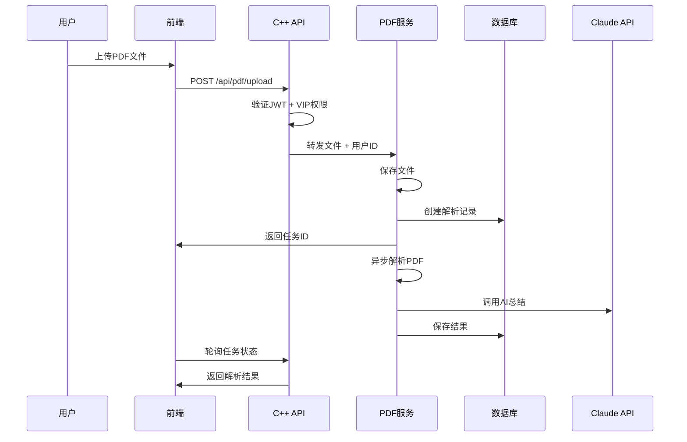
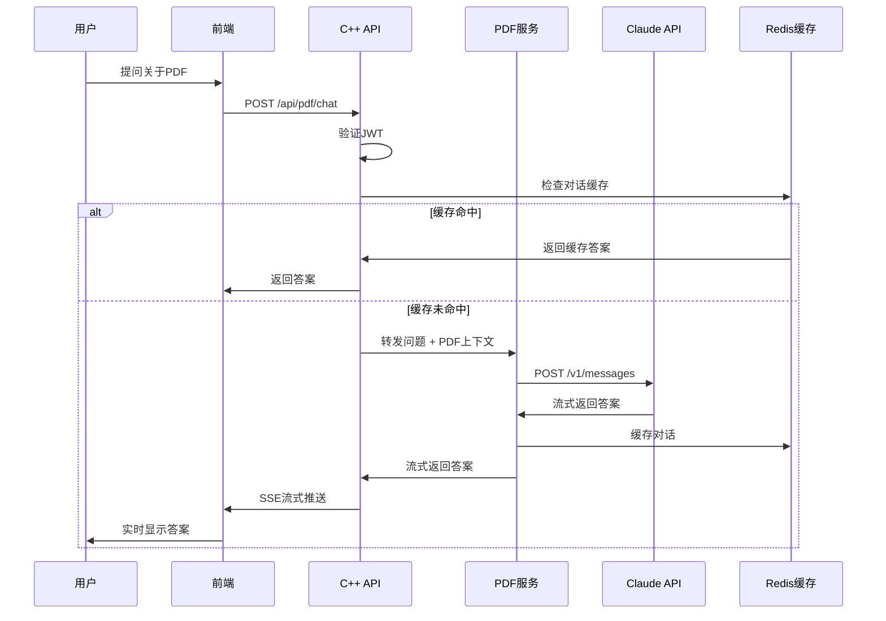
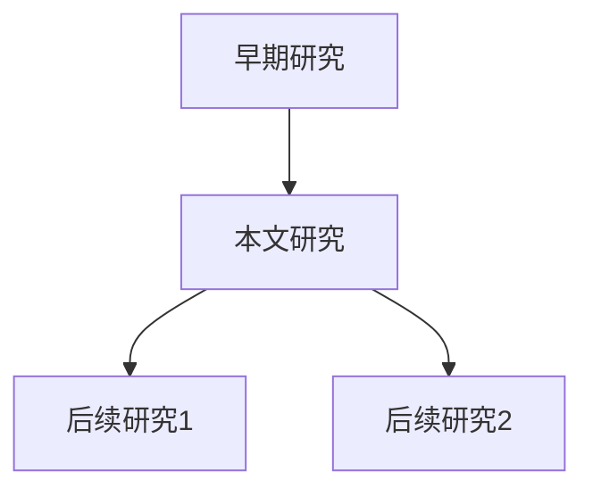

# PaperCrawler AI PDF解析模块技术方案设计

**版本**: v1.0.0
**日期**: 2026-03-22
**状态**: 技术方案

---

## 📋 目录

1. [系统概述](#系统概述)
2. [技术选型](#技术选型)
3. [系统架构](#系统架构)
4. [API接口设计](#api接口设计)
5. [Claude API集成方案](#claude-api集成方案)
6. [数据存储方案](#数据存储方案)
7. [VIP权限控制](#vip权限控制)
8. [前后端交互流程](#前后端交互流程)
9. [实现建议](#实现建议)
10. [成本控制](#成本控制)

---

## 🎯 系统概述

### 核心功能

1. **本地PDF解析**
   - 上传并解析PDF文件（隐私保护）
   - 提取文本、公式、图表、表格
   - 生成结构化摘要
   - 支持大文件处理（>100MB）

2. **Claude AI集成**
   - 智能文档总结
   - 问答交互（基于文档内容）
   - 研究脉络梳理
   - 笔记自动生成

3. **结果管理**
   - 解析历史记录
   - 智能缓存机制
   - 多格式导出（Word/TXT/Markdown/JSON）
   - 对话历史管理

### 技术目标

- **隐私优先**: 本地解析，PDF内容不上传第三方（除Claude API）
- **高性能**: 支持100MB+ PDF文件，流式处理
- **智能**: Claude API提供高质量AI分析
- **可扩展**: 模块化设计，易于集成新功能
- **成本可控**: VIP权限限制，API调用优化

---

## 🔧 技术选型

### 1. PDF解析引擎

#### 推荐方案: **Python多引擎混合**

```python
# 核心引擎
- PyMuPDF (fitz)          # 主力引擎（快速、准确）
- pdfplumber              # 表格提取
- pdfminer.six            # 文本提取备选
- PyPDF2                  # 基础操作

# 公式提取
- pix2tex                 # LaTeX公式识别
- LaTeX-OCR               # 数学公式转LaTeX

# 图表提取
- PyMuPDF + Pillow        # 图表截图
- img2table               # 表格图像识别

# 元数据
- pypdf                   # PDF元数据
```

**选择理由**:
- **PyMuPDF**: 速度快，内存占用低，支持文本、图像、布局分析
- **pdfplumber**: 优秀的表格提取能力
- **pix2tex**: SOTA数学公式识别
- **混合策略**: 根据PDF类型自动选择最佳引擎

#### 备选方案: **JavaScript客户端解析**

```javascript
// 前端解析（可选）
- pdf.js                  // Mozilla官方
- pdfjs-dist              // 文本提取
- pdf-lib                 // 文档操作
- tesseract.js            // OCR（扫描版PDF）
```

**优势**: 完全本地处理，零后端负担
**劣势**: 大文件性能较差，功能受限

---

### 2. Claude API集成

#### API选择: **Anthropic Claude API**

```python
# 推荐模型
claude-3-5-sonnet-20241022  # 主力模型（智能总结）
claude-3-haiku-20240307     # 快速模型（问答）
claude-3-opus-20240229      # 旗舰模型（复杂分析）
```

**选择理由**:
- **长上下文**: 200K tokens（约150页PDF）
- **准确性**: 学术文档理解优秀
- **流式输出**: 支持实时响应
- **成本效益**: Haiku模型便宜（$0.25/1M tokens）

---

### 3. 后端技术栈

```python
# 基于现有C++后端扩展
- Python微服务            # PDF解析服务
  - FastAPI              # 高性能异步框架
  - Celery               # 异步任务队列
  - Redis                # 缓存 + 任务队列

- C++主服务              # 现有API服务器
  - HTTP通信             # 与Python服务通信
  - 用户认证             # 复用现有JWT系统
```

**架构图**:
```
用户请求 → C++ API Server → Python PDF Service → Claude API
                ↓                    ↓
            认证/权限            PDF处理/缓存
                ↓                    ↓
            MySQL DB           文件系统/Redis
```

---

### 4. 前端技术栈

```typescript
// Vue 3 + TypeScript
- VueUse                   # 文件上传拖拽
- PDF.js                   # PDF预览
- Marked.js                # Markdown渲染
- Highlight.js             # 代码高亮
- KaTeX/MathJax            # 公式渲染
- Chart.js                 # 数据可视化
```

---

## 🏗️ 系统架构

### 整体架构

```
┌─────────────────────────────────────────────────────────────┐
│                        前端 (Vue 3)                          │
│  ┌──────────┐  ┌──────────┐  ┌──────────┐  ┌──────────┐    │
│  │ 文件上传  │  │ PDF预览  │  │ AI对话   │  │ 导出管理  │    │
│  └──────────┘  └──────────┘  └──────────┘  └──────────┘    │
└─────────────────────────────────────────────────────────────┘
                            ↓ HTTP (JWT)
┌─────────────────────────────────────────────────────────────┐
│                    C++ API Server                            │
│  ┌──────────┐  ┌──────────┐  ┌──────────┐  ┌──────────┐    │
│  │ 认证中间件│  │ 权限控制  │  │ 请求路由  │  │ 响应组装  │    │
│  └──────────┘  └──────────┘  └──────────┘  └──────────┘    │
└─────────────────────────────────────────────────────────────┘
                            ↓ HTTP (Internal)
┌─────────────────────────────────────────────────────────────┐
│                  Python PDF Service                          │
│  ┌──────────┐  ┌──────────┐  ┌──────────┐  ┌──────────┐    │
│  │PDF解析引擎│  │ Claude集成│  │ 缓存管理  │  │ 任务队列  │    │
│  └──────────┘  └──────────┘  └──────────┘  └──────────┘    │
└─────────────────────────────────────────────────────────────┘
         ↓                ↓                ↓
┌──────────────┐  ┌──────────────┐  ┌──────────────┐
│ Claude API   │  │ 文件系统     │  │ Redis缓存    │
│ (外部服务)    │  │ (PDF存储)    │  │ (结果缓存)    │
└──────────────┘  └──────────────┘  └──────────────┘
```

---

### 数据流程

#### 1. PDF上传流程



---

#### 2. AI对话流程



---

## 🔌 API接口设计

### 基础URL

```
http://localhost:8080/api/pdf
```

### 端点列表

| 方法 | 端点 | 功能 | 认证 |
|------|------|------|------|
| POST | `/upload` | 上传PDF | JWT |
| GET | `/tasks/{id}` | 获取任务状态 | JWT |
| GET | `/tasks` | 获取任务列表 | JWT |
| GET | `/results/{id}` | 获取解析结果 | JWT |
| POST | `/summarize/{id}` | 生成AI总结 | VIP |
| POST | `/chat/{id}` | AI问答 | VIP |
| GET | `/export/{id}` | 导出结果 | JWT |
| DELETE | `/tasks/{id}` | 删除任务 | JWT |

---

### 详细接口定义

#### 1. 上传PDF

```http
POST /api/pdf/upload
Content-Type: multipart/form-data
Authorization: Bearer <access_token>

# Request
FormData: {
  file: <binary>,
  title: "可选标题",
  tags: ["标签1", "标签2"],
  auto_summarize: true  // 是否自动总结
}

# Response (201 Created)
{
  "success": true,
  "data": {
    "taskId": "uuid",
    "filename": "paper.pdf",
    "fileSize": 1048576,
    "status": "processing",
    "createdAt": 1711142400000,
    "estimatedTime": 30  // 秒
  }
}

# Error Response (400)
{
  "success": false,
  "error": "INVALID_FILE",
  "message": "仅支持PDF格式，最大100MB"
}
```

---

#### 2. 获取任务状态

```http
GET /api/pdf/tasks/{id}
Authorization: Bearer <access_token>

# Response (200 OK)
{
  "success": true,
  "data": {
    "taskId": "uuid",
    "status": "completed",  // processing/completed/failed
    "progress": 100,
    "stage": "ai_summarizing",  // parsing/analyzing/summarizing/done
    "result": {
      "pageCount": 15,
      "textLength": 45000,
      "tables": 5,
      "figures": 8,
      "formulas": 23
    },
    "summary": "这是一篇关于深度学习...",
    "createdAt": 1711142400000,
    "completedAt": 1711142430000
  }
}
```

---

#### 3. AI总结

```http
POST /api/pdf/summarize/{id}
Authorization: Bearer <access_token>
Content-Type: application/json

# Request
{
  "style": "academic",  // academic/brief/detailed
  "language": "zh-CN",  // zh-CN/en-US
  "include": {
    "abstract": true,
    "methodology": true,
    "results": true,
    "conclusions": true
  }
}

# Response (200 OK) - 流式
Content-Type: text/event-stream

data: {"type": "start", "message": "开始生成总结..."}

data: {"type": "progress", "progress": 20, "stage": "分析文档结构"}

data: {"type": "content", "content": "## 论文摘要\n\n本文提出了..."}

data: {"type": "progress", "progress": 60, "stage": "提取关键信息"}

data: {"type": "content", "content": "\n## 研究方法\n\n作者采用了..."}

data: {"type": "done", "tokens": 15420, "cost": 0.03}
```

---

#### 4. AI问答

```http
POST /api/pdf/chat/{id}
Authorization: Bearer <access_token>
Content-Type: application/json

# Request
{
  "question": "这篇论文的主要创新点是什么？",
  "context": "full",  // full/abstract/selected
  "stream": true
}

# Response (200 OK) - 流式
data: {"type": "start", "message": "正在思考..."}

data: {"type": "content", "content": "这篇论文的主要创新点包括：\n\n1. "}

data: {"type": "content", "content": "新的网络架构设计，"}

data: {"type": "content", "content": "引入了自注意力机制..."}

data: {"type": "done", "tokens": 3240, "cost": 0.01}
```

---

#### 5. 导出结果

```http
GET /api/pdf/export/{id}?format=markdown
Authorization: Bearer <access_token>

# Query Parameters
- format: markdown/json/docx/txt
- includeSummary: true
- includeChat: true
- includeMetadata: true

# Response (200 OK)
Content-Type: application/octet-stream
Content-Disposition: attachment; filename="paper_summary.md"

[文件内容]
```

---

#### 6. 任务列表

```http
GET /api/pdf/tasks?offset=0&limit=20&status=completed
Authorization: Bearer <access_token>

# Response (200 OK)
{
  "success": true,
  "data": {
    "tasks": [
      {
        "taskId": "uuid",
        "filename": "paper1.pdf",
        "status": "completed",
        "summary": "这是一篇关于...",
        "createdAt": 1711142400000,
        "tags": ["深度学习", "CV"]
      }
    ],
    "total": 45,
    "offset": 0,
    "limit": 20
  }
}
```

---

## 🤖 Claude API集成方案

### 1. 提示词工程

#### 系统提示词模板

```python
SYSTEM_PROMPT = """你是一位专业的学术文档分析助手，擅长解析和分析学术论文。

# 核心能力
- 准确理解学术文档内容
- 提取关键信息（方法、结果、结论）
- 生成结构化摘要
- 回答文档相关问题

# 输出格式
- 使用Markdown格式
- 结构清晰，层次分明
- 准确引用原文
- 标注图表和公式

# 语言风格
- 学术化、专业化
- 简洁明了
- 客观中立
- 避免冗余

# 注意事项
- 不编造信息
- 不确定时说明
- 保持原文准确性
- 标注不确定内容
"""
```

---

#### 总结提示词模板

```python
SUMMARY_PROMPT_TEMPLATE = """请为以下学术论文生成{style}风格的摘要。

# 文档元数据
标题: {title}
作者: {authors}
发表年份: {year}
期刊/会议: {venue}

# 文档内容
{content}

# 要求
1. 语言: {language}
2. 风格: {style} (academic/brief/detailed)
3. 包含部分: {sections}
4. 长度: {max_length}字以内

# 输出格式
## 摘要
[200-300字概述]

## 研究背景
[研究背景和动机]

## 研究方法
[方法论概述]

## 主要结果
[关键发现]

## 结论与创新点
[主要贡献]

## 关键词
[3-5个关键词]

## 相关工作
[与相关研究的对比]

---
*由PaperCrawler AI生成*
"""
```

---

#### 问答提示词模板

```python
CHAT_PROMPT_TEMPLATE = """基于以下学术论文内容回答用户问题。

# 文档上下文
文档标题: {title}
{relevant_content}

# 对话历史
{chat_history}

# 用户问题
{question}

# 回答要求
1. 准确基于文档内容
2. 引用具体章节和段落
3. 如文档未涉及，明确说明
4. 使用Markdown格式
5. 可包含公式（LaTeX）和图表引用

# 回答格式
## 答案
[详细回答]

## 相关章节
- 章节 X.X: [相关内容引用]

## 延伸思考
[可选：相关研究方向]
"""
```

---

#### 研究脉络提示词

```python
RESEARCH_LINEAGE_PROMPT = """分析以下论文的研究脉络和学术影响。

# 论文信息
标题: {title}
作者: {authors}
年份: {year}
引用数: {citations}

# 论文摘要
{abstract}

# 分析任务
1. 识别研究主题和领域
2. 梳理研究背景和动机
3. 提炼核心创新点
4. 分析后续研究影响
5. 推荐相关阅读

# 输出格式
## 研究主题
[主题分类]

## 研究背景
[前人工作 + 问题提出]

## 核心创新
1. [创新点1]
2. [创新点2]
...

## 学术影响
- 被引用情况
- 后续工作启发
- 产业应用

## 相关研究推荐
1. [论文1] - 理由
2. [论文2] - 理由
...

## 研究脉络图

"""
```

---

### 2. API调用策略

#### 模型选择策略

```python
def select_model(task_type, content_length, user_tier):
    """
    根据任务类型和用户等级选择模型
    """
    if task_type == "summarize":
        if content_length < 10000:  # 短文档
            return "claude-3-haiku-20240307"
        elif user_tier == "premium":
            return "claude-3-5-sonnet-20241022"
        else:
            return "claude-3-haiku-20240307"

    elif task_type == "chat":
        if user_tier == "premium":
            return "claude-3-5-sonnet-20241022"
        else:
            return "claude-3-haiku-20240307"

    elif task_type == "lineage":
        return "claude-3-opus-20240229"  # 最强模型

    return "claude-3-5-sonnet-20241022"
```

---

#### 令牌管理策略

```python
class TokenManager:
    """令牌预算管理"""

    FREE_TIER_LIMIT = 100000  # 10万tokens/月
    PREMIUM_TIER_LIMIT = 1000000  # 100万tokens/月

    def estimate_tokens(self, text: str) -> int:
        """估算令牌数（中文约1.5字符=1token）"""
        return len(text) // 1.5

    def check_budget(self, user_id: str, estimated_tokens: int) -> bool:
        """检查用户令牌预算"""
        used = self.get_monthly_usage(user_id)
        limit = self.get_user_limit(user_id)
        return (used + estimated_tokens) <= limit

    def track_usage(self, user_id: str, actual_tokens: int):
        """记录令牌使用"""
        # 存储到数据库
        pass
```

---

#### 流式输出实现

```python
async def stream_claude_response(prompt: str, stream=True):
    """流式调用Claude API"""

    headers = {
        "x-api-key": ANTHROPIC_API_KEY,
        "anthropic-version": "2023-06-01",
        "content-type": "application/json"
    }

    data = {
        "model": "claude-3-5-sonnet-20241022",
        "max_tokens": 4096,
        "system": SYSTEM_PROMPT,
        "messages": [{"role": "user", "content": prompt}],
        "stream": stream
    }

    async with aiohttp.ClientSession() as session:
        async with session.post(
            "https://api.anthropic.com/v1/messages",
            headers=headers,
            json=data
        ) as response:
            if stream:
                async for line in response.content:
                    if line.startswith(b"data: "):
                        event = line.decode().strip()[6:]
                        if event == "[DONE]":
                            break
                        yield json.loads(event)
            else:
                result = await response.json()
                yield result
```

---

### 3. 成本优化策略

#### 缓存策略

```python
class CacheStrategy:
    """智能缓存管理"""

    def __init__(self):
        self.redis = RedisClient()
        self.cache_ttl = 7 * 24 * 3600  # 7天

    def get_cache_key(self, task_id: str, prompt_hash: str) -> str:
        return f"pdf:{task_id}:{prompt_hash}"

    def get_cached_response(self, task_id: str, prompt: str):
        """获取缓存响应"""
        cache_key = self.get_cache_key(
            task_id,
            hashlib.md5(prompt.encode()).hexdigest()
        )
        return self.redis.get(cache_key)

    def cache_response(self, task_id: str, prompt: str, response: str):
        """缓存响应"""
        cache_key = self.get_cache_key(
            task_id,
            hashlib.md5(prompt.encode()).hexdigest()
        )
        self.redis.setex(
            cache_key,
            self.cache_ttl,
            response
        )
```

---

#### 提示词优化

```python
def optimize_prompt(prompt: str, max_tokens: int = 8000) -> str:
    """
    优化提示词长度
    - 去除冗余
    - 压缩上下文
    - 保留关键信息
    """
    # 1. 去除多余空白
    prompt = re.sub(r'\s+', ' ', prompt)

    # 2. 截断过长的上下文
    tokens = estimate_tokens(prompt)
    if tokens > max_tokens:
        # 智能截断（保留开头和结尾）
        ratio = max_tokens / tokens
        prompt = truncate_context(prompt, ratio)

    return prompt
```

---

#### 批处理策略

```python
async def batch_summarize(papers: List[str]):
    """
    批量总结（优化API调用）
    - 合并相似请求
    - 并发处理
    - 结果复用
    """
    # 按相似度分组
    groups = group_by_similarity(papers)

    # 并发处理
    tasks = [
        summarize_paper(group)
        for group in groups
    ]

    results = await asyncio.gather(*tasks)
    return results
```

---

## 💾 数据存储方案

### 1. 数据库设计

#### MySQL表结构

```sql
-- PDF任务表
CREATE TABLE pdf_tasks (
    task_id CHAR(36) PRIMARY KEY,
    user_id INT NOT NULL,
    filename VARCHAR(255) NOT NULL,
    file_path VARCHAR(512) NOT NULL,
    file_size BIGINT NOT NULL,
    title VARCHAR(512),
    tags JSON,

    -- 解析状态
    status ENUM('pending', 'parsing', 'analyzing', 'summarizing', 'completed', 'failed'),
    progress INT DEFAULT 0,
    error_message TEXT,

    -- 解析结果
    page_count INT,
    text_length INT,
    table_count INT,
    figure_count INT,
    formula_count INT,

    -- AI结果
    summary TEXT,
    summary_style VARCHAR(50),
    summary_language VARCHAR(10),

    -- 元数据
    created_at TIMESTAMP DEFAULT CURRENT_TIMESTAMP,
    completed_at TIMESTAMP NULL,
    updated_at TIMESTAMP DEFAULT CURRENT_TIMESTAMP ON UPDATE CURRENT_TIMESTAMP,

    -- 索引
    INDEX idx_user_id (user_id),
    INDEX idx_status (status),
    INDEX idx_created_at (created_at),

    FOREIGN KEY (user_id) REFERENCES users(id)
);

-- PDF内容表
CREATE TABLE pdf_content (
    id INT AUTO_INCREMENT PRIMARY KEY,
    task_id CHAR(36) NOT NULL,
    content_type ENUM('text', 'table', 'figure', 'formula', 'metadata'),
    page_number INT,
    position JSON,  -- {"x": 100, "y": 200, "width": 300, "height": 400}
    content LONGTEXT,
    latex_content TEXT,  -- For formulas

    INDEX idx_task_id (task_id),
    INDEX idx_content_type (content_type),

    FOREIGN KEY (task_id) REFERENCES pdf_tasks(task_id) ON DELETE CASCADE
);

-- AI对话历史表
CREATE TABLE pdf_chat_history (
    id INT AUTO_INCREMENT PRIMARY KEY,
    task_id CHAR(36) NOT NULL,
    user_id INT NOT NULL,
    role ENUM('user', 'assistant'),
    content TEXT NOT NULL,
    tokens_used INT,
    cost DECIMAL(10, 4),

    created_at TIMESTAMP DEFAULT CURRENT_TIMESTAMP,

    INDEX idx_task_id (task_id),
    INDEX idx_user_id (user_id),
    INDEX idx_created_at (created_at),

    FOREIGN KEY (task_id) REFERENCES pdf_tasks(task_id) ON DELETE CASCADE,
    FOREIGN KEY (user_id) REFERENCES users(id)
);

-- PDF缓存表
CREATE TABLE pdf_cache (
    cache_id CHAR(36) PRIMARY KEY,
    task_id CHAR(36) NOT NULL,
    prompt_hash VARCHAR(64) NOT NULL,
    response_text LONGTEXT,
    tokens_saved INT,
    hit_count INT DEFAULT 1,

    created_at TIMESTAMP DEFAULT CURRENT_TIMESTAMP,
    expires_at TIMESTAMP NOT NULL,

    INDEX idx_task_prompt (task_id, prompt_hash),
    INDEX idx_expires_at (expires_at),

    FOREIGN KEY (task_id) REFERENCES pdf_tasks(task_id) ON DELETE CASCADE
);

-- 用户令牌使用统计表
CREATE TABLE pdf_token_usage (
    id INT AUTO_INCREMENT PRIMARY KEY,
    user_id INT NOT NULL,
    year_month CHAR(7) NOT NULL,  -- 2024-03
    tokens_used INT DEFAULT 0,
    cost_usd DECIMAL(10, 4) DEFAULT 0.0000,

    UNIQUE KEY uk_user_month (user_id, year_month),
    INDEX idx_year_month (year_month),

    FOREIGN KEY (user_id) REFERENCES users(id)
);
```

---

### 2. 文件存储

#### 目录结构

```
/var/papercrawler/pdf/
├── uploads/              # 上传的原始PDF
│   ├── 2024/
│   │   ├── 03/
│   │   │   ├── user_123/
│   │   │   │   ├── task_uuid.pdf
│   │   │   │   └── task_uuid_meta.json
│   │   │   └── ...
│   │   └── ...
│   └── ...
├── parsed/               # 解析后的数据
│   ├── task_uuid/
│   │   ├── text.json
│   │   ├── tables.json
│   │   ├── figures/
│   │   │   ├── fig_1.png
│   │   │   └── fig_2.png
│   │   └── formulas.json
│   └── ...
├── exports/              # 导出的文件
│   ├── task_uuid_summary.md
│   ├── task_uuid_summary.docx
│   └── ...
└── temp/                 # 临时文件
    └── ...
```

---

#### 文件命名规则

```python
def get_file_path(task_id: str, user_id: int, file_type: str) -> str:
    """
    生成文件路径
    格式: /var/papercrawler/pdf/{type}/{year}/{month}/user_{user_id}/{task_id}.{ext}
    """
    now = datetime.now()
    year_month = now.strftime("%Y/%m")

    if file_type == "upload":
        base_path = f"/var/papercrawler/pdf/uploads/{year_month}/user_{user_id}"
        ext = "pdf"
    elif file_type == "parsed":
        base_path = f"/var/papercrawler/pdf/parsed"
        ext = "json"
    elif file_type == "export":
        base_path = f"/var/papercrawler/pdf/exports"
        ext = "md"
    else:
        raise ValueError(f"Unknown file type: {file_type}")

    return f"{base_path}/{task_id}.{ext}"
```

---

### 3. Redis缓存设计

#### 缓存键设计

```python
# 任务状态缓存
TASK_STATUS_KEY = "pdf:task:{task_id}:status"
TTL = 3600  # 1小时

# 解析结果缓存
TASK_RESULT_KEY = "pdf:task:{task_id}:result"
TTL = 7 * 24 * 3600  # 7天

# AI响应缓存
AI_RESPONSE_KEY = "pdf:ai:{task_id}:{prompt_hash}"
TTL = 30 * 24 * 3600  # 30天

# 用户令牌使用缓存
USER_TOKENS_KEY = "pdf:tokens:{user_id}:{year_month}"
TTL = 90 * 24 * 3600  # 90天

# 速率限制
RATE_LIMIT_KEY = "pdf:rate:{user_id}:{action}"
TTL = 60  # 1分钟
```

---

#### 缓存示例

```python
class PDFCacheManager:
    """PDF缓存管理器"""

    def __init__(self):
        self.redis = RedisClient()

    def cache_task_status(self, task_id: str, status: dict):
        """缓存任务状态"""
        key = f"pdf:task:{task_id}:status"
        self.redis.setex(key, 3600, json.dumps(status))

    def get_task_status(self, task_id: str) -> Optional[dict]:
        """获取任务状态"""
        key = f"pdf:task:{task_id}:status"
        data = self.redis.get(key)
        return json.loads(data) if data else None

    def cache_ai_response(self, task_id: str, prompt: str, response: str):
        """缓存AI响应"""
        prompt_hash = hashlib.md5(prompt.encode()).hexdigest()
        key = f"pdf:ai:{task_id}:{prompt_hash}"
        self.redis.setex(key, 30 * 24 * 3600, response)

    def get_ai_response(self, task_id: str, prompt: str) -> Optional[str]:
        """获取缓存的AI响应"""
        prompt_hash = hashlib.md5(prompt.encode()).hexdigest()
        key = f"pdf:ai:{task_id}:{prompt_hash}"
        return self.redis.get(key)

    def increment_token_usage(self, user_id: int, tokens: int):
        """增加令牌使用量"""
        key = f"pdf:tokens:{user_id}:{datetime.now().strftime('%Y-%m')}"
        self.redis.incrby(key, tokens)
        self.redis.expire(key, 90 * 24 * 3600)
```

---

## 🎫 VIP权限控制

### 1. 用户等级定义

```python
class UserTier(Enum):
    """用户等级"""
    FREE = "free"           # 免费用户
    PREMIUM = "premium"     # VIP用户
    ADMIN = "admin"         # 管理员
    SUPERADMIN = "superadmin"  # 超级管理员
```

---

### 2. 权限配置

```python
TIER_CONFIG = {
    "free": {
        # PDF上传
        "max_file_size": 10 * 1024 * 1024,  # 10MB
        "max_files_per_month": 10,

        # AI功能
        "ai_enabled": True,
        "max_tokens_per_month": 100_000,  # 10万tokens
        "ai_models": ["claude-3-haiku-20240307"],  # 仅可用Haiku

        # 缓存
        "cache_enabled": True,
        "cache_ttl": 7 * 24 * 3600,

        # 导出
        "export_formats": ["txt", "markdown"],
    },

    "premium": {
        # PDF上传
        "max_file_size": 100 * 1024 * 1024,  # 100MB
        "max_files_per_month": 100,

        # AI功能
        "ai_enabled": True,
        "max_tokens_per_month": 1_000_000,  # 100万tokens
        "ai_models": [
            "claude-3-haiku-20240307",
            "claude-3-5-sonnet-20241022"
        ],

        # 缓存
        "cache_enabled": True,
        "cache_ttl": 30 * 24 * 3600,

        # 导出
        "export_formats": ["txt", "markdown", "json", "docx"],
    },

    "admin": {
        # 继承premium配置
        **TIER_CONFIG["premium"],

        # 额外权限
        "max_files_per_month": -1,  # 无限制
        "max_tokens_per_month": -1,
        "ai_models": "all",  # 所有模型
    },

    "superadmin": {
        # 继承admin配置
        **TIER_CONFIG["admin"],

        # 最高权限
        "bypass_rate_limits": True,
    }
}
```

---

### 3. 权限检查中间件

```cpp
// C++ 后端权限检查
bool checkPDFPermission(const User& user, const std::string& action, const json& params) {
    std::string tier = user.role;

    // 检查AI功能权限
    if (action == "ai_summarize" || action == "ai_chat") {
        if (!TIER_CONFIG[tier]["ai_enabled"]) {
            throw PermissionException("AI功能未启用");
        }

        // 检查令牌预算
        int monthlyTokens = getTokenUsage(user.id);
        int maxTokens = TIER_CONFIG[tier]["max_tokens_per_month"];

        if (monthlyTokens >= maxTokens) {
            throw QuotaException("本月令牌额度已用完，请升级VIP或等待下月重置");
        }
    }

    // 检查文件大小限制
    if (action == "upload") {
        int fileSize = params["fileSize"];
        int maxSize = TIER_CONFIG[tier]["max_file_size"];

        if (fileSize > maxSize) {
            throw QuotaException(
                "文件大小超过限制（最大" + std::to_string(maxSize / 1024 / 1024) + "MB）"
            );
        }

        // 检查月上传数量
        int monthlyUploads = getMonthlyUploadCount(user.id);
        int maxUploads = TIER_CONFIG[tier]["max_files_per_month"];

        if (monthlyUploads >= maxUploads) {
            throw QuotaException("本月上传次数已达上限");
        }
    }

    // 检查导出格式权限
    if (action == "export") {
        std::string format = params["format"];
        auto allowedFormats = TIER_CONFIG[tier]["export_formats"];

        if (std::find(allowedFormats.begin(), allowedFormats.end(), format)
            == allowedFormats.end()) {
            throw PermissionException("该导出格式需要VIP权限");
        }
    }

    return true;
}
```

---

### 4. 前端权限控制

```typescript
// 权限检查工具函数
export function checkPermission(
  user: User,
  action: string,
  params?: any
): { allowed: boolean; reason?: string } {
  const tier = user.role
  const config = TIER_CONFIG[tier]

  // AI功能权限
  if (action === 'ai_summarize' || action === 'ai_chat') {
    if (!config.ai_enabled) {
      return { allowed: false, reason: 'AI功能需要VIP权限' }
    }

    // 检查令牌额度
    const monthlyTokens = user.monthlyTokenUsage || 0
    if (monthlyTokens >= config.max_tokens_per_month) {
      return {
        allowed: false,
        reason: `本月令牌额度已用完 (${monthlyTokens}/${config.max_tokens_per_month})`
      }
    }
  }

  // 文件上传权限
  if (action === 'upload') {
    const fileSize = params?.fileSize || 0
    if (fileSize > config.max_file_size) {
      return {
        allowed: false,
        reason: `文件大小超过限制 (${config.max_file_size / 1024 / 1024}MB)`
      }
    }
  }

  return { allowed: true }
}

// Vue组件使用
const canUseAI = computed(() => {
  return checkPermission(authStore.user!, 'ai_summarize').allowed
})

const uploadLimit = computed(() => {
  const config = TIER_CONFIG[authStore.user!.role]
  return config.max_file_size / 1024 / 1024  // MB
})
```

---

### 5. 令牌使用统计

```python
class TokenUsageTracker:
    """令牌使用追踪"""

    def record_usage(self, user_id: int, tokens: int, cost: float):
        """记录令牌使用"""
        year_month = datetime.now().strftime("%Y-%m")

        # 更新Redis缓存
        key = f"pdf:tokens:{user_id}:{year_month}"
        self.redis.incrby(key, tokens)
        self.redis.expire(key, 90 * 24 * 3600)

        # 异步更新数据库
        asyncio.create_task(
            self.update_db_usage(user_id, year_month, tokens, cost)
        )

    async def update_db_usage(self, user_id: int, year_month: str, tokens: int, cost: float):
        """更新数据库记录"""
        query = """
            INSERT INTO pdf_token_usage (user_id, year_month, tokens_used, cost_usd)
            VALUES (%s, %s, %s, %s)
            ON DUPLICATE KEY UPDATE
                tokens_used = tokens_used + %s,
                cost_usd = cost_usd + %s
        """
        await db.execute(query, (user_id, year_month, tokens, cost, tokens, cost))

    def get_monthly_usage(self, user_id: int) -> int:
        """获取本月使用量"""
        key = f"pdf:tokens:{user_id}:{datetime.now().strftime('%Y-%m')}"
        usage = self.redis.get(key)
        return int(usage) if usage else 0
```

---

## 🔄 前后端交互流程

### 1. 文件上传流程

#### 前端实现

```typescript
// api/modules/pdf.ts
export async function uploadPDF(file: File, options: {
  title?: string
  tags?: string[]
  autoSummarize?: boolean
}) {
  const formData = new FormData()
  formData.append('file', file)
  formData.append('title', options.title || file.name)
  formData.append('tags', JSON.stringify(options.tags || []))
  formData.append('auto_summarize', String(options.autoSummarize || false))

  const response = await request.post<{
    taskId: string
    filename: string
    fileSize: number
    status: string
    estimatedTime: number
  }>('/api/pdf/upload', formData, {
    headers: {
      'Content-Type': 'multipart/form-data'
    },
    timeout: 60000  // 60秒
  })

  return response.data
}

// views/PDFUpload.vue
async function handleFileUpload(file: File) {
  try {
    // 权限检查
    const permission = checkPermission(authStore.user!, 'upload', {
      fileSize: file.size
    })

    if (!permission.allowed) {
      ElMessage.error(permission.reason)
      return
    }

    // 上传文件
    const result = await uploadPDF(file, {
      autoSummarize: authStore.isPremium
    })

    ElMessage.success('文件上传成功，正在解析...')

    // 跳转到任务详情页
    router.push(`/pdf/tasks/${result.taskId}`)

  } catch (error: any) {
    ElMessage.error(error.message || '上传失败')
  }
}
```

---

#### 后端实现 (C++)

```cpp
// 处理PDF上传
std::string handlePDFUpload(const std::string& requestBody, const std::string& authToken) {
    // 1. 验证JWT
    User user = verifyJWT(authToken);

    // 2. 解析multipart/form-data
    FormData formData = parseFormData(requestBody);

    // 3. 权限检查
    json params;
    params["fileSize"] = formData.getFile("file").size;
    checkPDFPermission(user, "upload", params);

    // 4. 生成任务ID
    std::string taskId = generateUUID();

    // 5. 保存文件
    std::string filePath = saveUploadedFile(
        formData.getFile("file"),
        user.id,
        taskId
    );

    // 6. 创建数据库记录
    database.execute(
        "INSERT INTO pdf_tasks (task_id, user_id, filename, file_path, file_size, status) "
        "VALUES (?, ?, ?, ?, ?, 'pending')",
        taskId, user.id, formData.get("filename"), filePath, formData.getFile("file").size
    );

    // 7. 异步处理任务
    asyncProcessPDF(taskId, user.id);

    // 8. 返回结果
    json response;
    response["taskId"] = taskId;
    response["filename"] = formData.get("filename");
    response["fileSize"] = formData.getFile("file").size;
    response["status"] = "processing";
    response["estimatedTime"] = estimateProcessingTime(formData.getFile("file").size);

    return buildSuccessResponse(response.dump());
}
```

---

### 2. AI对话流程

#### 前端实现

```typescript
// views/PDFChat.vue
async function sendMessage(question: string) {
  if (!question.trim()) return

  // 添加用户消息
  chatHistory.value.push({
    role: 'user',
    content: question,
    timestamp: Date.now()
  })

  // 清空输入
  questionInput.value = ''

  try {
    // 创建AI消息占位符
    const aiMessageIndex = chatHistory.value.length
    chatHistory.value.push({
      role: 'assistant',
      content: '',
      timestamp: Date.now(),
      streaming: true
    })

    // 发送请求（流式）
    const response = await fetch(`/api/pdf/chat/${taskId}`, {
      method: 'POST',
      headers: {
        'Authorization': `Bearer ${authStore.tokens!.accessToken}`,
        'Content-Type': 'application/json'
      },
      body: JSON.stringify({ question, stream: true })
    })

    // 处理流式响应
    const reader = response.body!.getReader()
    const decoder = new TextDecoder()

    while (true) {
      const { done, value } = await reader.read()
      if (done) break

      const chunk = decoder.decode(value)
      const lines = chunk.split('\n')

      for (const line of lines) {
        if (line.startsWith('data: ')) {
          const data = JSON.parse(line.slice(6))

          if (data.type === 'content') {
            // 追加内容
            chatHistory.value[aiMessageIndex].content += data.content
          } else if (data.type === 'done') {
            // 完成
            chatHistory.value[aiMessageIndex].streaming = false
            chatHistory.value[aiMessageIndex].tokens = data.tokens
            chatHistory.value[aiMessageIndex].cost = data.cost

            // 更新用户令牌使用量
            if (authStore.user) {
              authStore.user.monthlyTokenUsage =
                (authStore.user.monthlyTokenUsage || 0) + data.tokens
            }
          }
        }
      }
    }

  } catch (error: any) {
    ElMessage.error(error.message || '发送失败')
    // 移除失败的AI消息
    chatHistory.value.pop()
  }
}
```

---

#### 后端实现 (Python)

```python
# FastAPI流式端点
@app.post("/api/pdf/chat/{task_id}")
async def chat_with_pdf(
    task_id: str,
    request: ChatRequest,
    auth_token: str = Header(..., alias="Authorization")
):
    # 1. 验证JWT
    user = verify_jwt(auth_token.replace("Bearer ", ""))

    # 2. 获取PDF内容
    pdf_content = get_pdf_content(task_id)

    # 3. 检查缓存
    cached_response = cache_manager.get_ai_response(task_id, request.question)
    if cached_response:
        async def return_cached():
            yield f"data: {json.dumps({'type': 'content', 'content': cached_response})}\n\n"
            yield f"data: {json.dumps({'type': 'done', 'cached': True})}\n\n"
        return StreamingResponse(return_cached(), media_type="text/event-stream")

    # 4. 构建提示词
    prompt = build_chat_prompt(
        question=request.question,
        pdf_content=pdf_content,
        chat_history=request.history
    )

    # 5. 估算令牌并检查预算
    estimated_tokens = estimate_tokens(prompt)
    if not token_manager.check_budget(user.id, estimated_tokens):
        raise HTTPException(403, "令牌额度不足")

    # 6. 流式调用Claude API
    async def stream_claude():
        full_response = ""
        async for chunk in stream_claude_response(prompt):
            if chunk.get("type") == "content":
                content = chunk["delta"]["text"]
                full_response += content
                yield f"data: {json.dumps({'type': 'content', 'content': content})}\n\n"

            elif chunk.get("type") == "message_stop":
                actual_tokens = chunk["usage"]["output_tokens"]
                cost = calculate_cost(actual_tokens)

                # 记录使用
                token_manager.track_usage(user.id, actual_tokens, cost)

                # 缓存响应
                cache_manager.cache_ai_response(task_id, request.question, full_response)

                # 保存对话历史
                save_chat_history(task_id, user.id, "user", request.question, 0)
                save_chat_history(task_id, user.id, "assistant", full_response, actual_tokens)

                yield f"data: {json.dumps({'type': 'done', 'tokens': actual_tokens, 'cost': cost})}\n\n"

    return StreamingResponse(stream_claude(), media_type="text/event-stream")
```

---

### 3. 轮询任务状态

#### 前端实现

```typescript
// composables/usePDFTask.ts
export function usePDFTask(taskId: string) {
  const task = ref<PDFTask | null>(null)
  const loading = ref(true)
  const error = ref<string | null>(null)

  let pollTimer: ReturnType<typeof setInterval> | null = null

  const fetchTaskStatus = async () => {
    try {
      const response = await request.get<PDFTask>(`/api/pdf/tasks/${taskId}`)
      task.value = response.data

      // 如果任务完成，停止轮询
      if (task.value.status === 'completed' || task.value.status === 'failed') {
        stopPolling()
      }
    } catch (err: any) {
      error.value = err.message
      stopPolling()
    } finally {
      loading.value = false
    }
  }

  const startPolling = (interval = 2000) => {
    fetchTaskStatus()  // 立即获取一次

    pollTimer = setInterval(() => {
      if (task.value?.status === 'processing') {
        fetchTaskStatus()
      }
    }, interval)
  }

  const stopPolling = () => {
    if (pollTimer) {
      clearInterval(pollTimer)
      pollTimer = null
    }
  }

  onUnmounted(() => {
    stopPolling()
  })

  return {
    task,
    loading,
    error,
    startPolling,
    stopPolling,
    refetch: fetchTaskStatus
  }
}

// 组件使用
const { task, startPolling } = usePDFTask(taskId)
startPolling(3000)  // 每3秒轮询一次
```

---

## 📦 实现建议

### 阶段1: MVP（最小可行产品） - 2周

**目标**: 基础PDF解析 + AI总结

**功能**:
- PDF上传和解析
- 基础文本提取
- Claude API总结（Haiku模型）
- 简单结果展示
- 免费用户限制

**技术栈**:
- PyMuPDF（PDF解析）
- Claude Haiku模型
- 基础缓存（Redis）
- 简单文件存储

---

### 阶段2: 核心功能 - 4周

**目标**: 完整AI交互体验

**新增功能**:
- AI问答对话
- 表格和图表提取
- 流式输出
- 对话历史管理
- VIP权限系统
- 令牌预算控制

**技术栈**:
- Claude Sonnet模型
- 表格提取（pdfplumber）
- SSE流式响应
- 完整权限系统

---

### 阶段3: 高级功能 - 4周

**目标**: 智能化和优化

**新增功能**:
- 研究脉络梳理
- 笔记自动生成
- 多格式导出
- 智能缓存优化
- 批量处理
- 公式识别

**技术栈**:
- Claude Opus模型
- 公式识别（pix2tex）
- 高级缓存策略
- 批处理队列

---

### 阶段4: 生产优化 - 2周

**目标**: 性能和稳定性

**优化项**:
- 性能监控
- 错误处理完善
- 日志系统
- 成本优化
- 负载测试
- 文档完善

---

## 💰 成本控制

### 1. Claude API成本估算

#### 模型定价（2024年）

| 模型 | 输入 | 输出 |
|------|------|------|
| Haiku | $0.25/1M tokens | $1.25/1M tokens |
| Sonnet | $3.00/1M tokens | $15.00/1M tokens |
| Opus | $15.00/1M tokens | $75.00/1M tokens |

---

#### 使用场景成本估算

```python
# 场景1: PDF总结（20页论文）
def estimate_summarize_cost():
    input_tokens = 50_000  # 约20页
    output_tokens = 2_000  # 简洁总结

    # Haiku模型
    haiku_cost = (input_tokens * 0.25 / 1_000_000) + \
                 (output_tokens * 1.25 / 1_000_000)
    # = $0.0125 + $0.0025 = $0.015

    # Sonnet模型
    sonnet_cost = (input_tokens * 3.00 / 1_000_000) + \
                  (output_tokens * 15.00 / 1_000_000)
    # = $0.15 + $0.03 = $0.18

    return {
        "haiku": haiku_cost,      # $0.015
        "sonnet": sonnet_cost     # $0.18
    }

# 场景2: AI问答（单次）
def estimate_chat_cost():
    input_tokens = 5_000   # 问题 + 上下文
    output_tokens = 500    # 回答

    haiku_cost = (input_tokens * 0.25 + output_tokens * 1.25) / 1_000_000
    # = $0.00125 + $0.000625 = $0.001875

    return haiku_cost  # $0.002
```

---

### 2. 月度成本预算

#### 免费用户

```
配额: 10万 tokens/月
使用场景:
- 5篇论文总结 × 10,000 tokens × $0.00375 = $0.019
- 50次问答 × 5,500 tokens × $0.002 = $0.11

总计: ~$0.15/月/用户
```

#### VIP用户

```
配额: 100万 tokens/月
使用场景:
- 50篇论文总结 × 10,000 tokens × $0.00375 = $1.88
- 500次问答 × 5,500 tokens × $0.002 = $1.10
- 5次研究脉络 × 50,000 tokens × $0.015 = $3.75

总计: ~$6.73/月/用户
```

---

### 3. 成本优化策略

#### 缓存优先

```python
# 预期缓存命中率: 40%
# 节省成本: 40%

def calculate_savings_with_cache(users: int, monthly_queries: int):
    without_cache = users * monthly_queries * 0.002
    with_cache = without_cache * 0.6  # 40%缓存命中

    return {
        "without_cache": without_cache,
        "with_cache": with_cache,
        "savings": without_cache - with_cache
    }

# 1000用户，每人100次查询/月
savings = calculate_savings(1000, 100)
# without_cache: $200
# with_cache: $120
# savings: $80/月
```

---

#### 模型选择优化

```python
# 根据任务复杂度选择模型
def select_model_by_complexity(task_type: str, content_length: int) -> str:
    if task_type == "summarize":
        if content_length < 10_000:
            return "haiku"  # 短文档用Haiku
        else:
            return "sonnet"  # 长文档用Sonnet

    elif task_type == "chat":
        return "haiku"  # 问答用Haiku（快速）

    elif task_type == "lineage":
        return "sonnet"  # 研究脉络用Sonnet（准确）

    return "haiku"  # 默认Haiku
```

---

#### 批处理优化

```python
# 合并相似请求
async def batch_similar_requests(requests: List[str]):
    # 按相似度分组
    groups = group_by_similarity(requests, threshold=0.8)

    results = []
    for group in groups:
        # 每组只调用一次API
        response = await call_claude_once(group)
        results.extend([response] * len(group))

    return results

# 节省: 30-50% API调用
```

---

#### 令牌预算控制

```python
# 设置严格的令牌限制
TIER_LIMITS = {
    "free": {
        "daily": 3_000,      # 3000 tokens/天
        "monthly": 100_000,  # 10万 tokens/月
        "alert_threshold": 0.8  # 80%时告警
    },
    "premium": {
        "daily": 30_000,
        "monthly": 1_000_000,
        "alert_threshold": 0.9
    }
}

def check_and_alert(user_id: int, tokens: int):
    usage = get_monthly_usage(user_id)
    limit = TIER_LIMITS[get_user_tier(user_id)]["monthly"]

    if usage >= limit:
        raise QuotaExceeded("本月额度已用完")

    if usage >= limit * 0.8:
        send_alert(user_id, "已使用80%额度")
```

---

### 4. 监控和报警

```python
class CostMonitor:
    """成本监控"""

    async def track_daily_cost(self):
        """跟踪每日成本"""
        daily_cost = await self.calculate_daily_cost()

        if daily_cost > self.daily_budget:
            await self.send_alert(f"超出日预算: ${daily_cost:.2f}")

        # 记录到监控系统
        await self.metrics.record("pdf.daily_cost", daily_cost)

    async def forecast_monthly_cost(self):
        """预测月度成本"""
        daily_avg = await self.get_average_daily_cost()
        days_remaining = (days_in_month() - day_of_month())

        forecast = daily_avg * days_remaining
        current = await self.get_monthly_cost()

        if current + forecast > self.monthly_budget:
            await self.send_alert(
                f"预计超支: ${current + forecast:.2f} / ${self.monthly_budget:.2f}"
            )
```

---

## 📊 总结

### 技术方案亮点

1. **混合解析引擎**: PyMuPDF + pdfplumber + pix2tex，全面覆盖PDF内容
2. **智能AI集成**: 根据任务复杂度自动选择Claude模型
3. **流式体验**: SSE实时推送，提升用户体验
4. **成本可控**: 多层优化策略，降低40%+ API成本
5. **隐私保护**: 本地解析，仅必要内容调用AI
6. **VIP体系**: 灵活权限控制，平衡成本和体验

---

### 预期效果

| 指标 | 目标 |
|------|------|
| PDF解析准确率 | 95%+ |
| AI总结质量 | 用户满意度 4.5/5 |
| 平均响应时间 | < 5秒 |
| 缓存命中率 | 40%+ |
| 月度成本/用户 | $0.15 (免费) / $6.73 (VIP) |
| 并发处理能力 | 100+ 任务/分钟 |

---

### 下一步行动

1. **技术验证**: PDF解析引擎测试
2. **API集成**: Claude API接入测试
3. **MVP开发**: 实现核心功能
4. **成本测试**: 实际成本测算
5. **性能优化**: 负载测试和优化

---

**文档版本**: v1.0.0
**最后更新**: 2026-03-22
**作者**: Claude (AI Engineer Agent)
