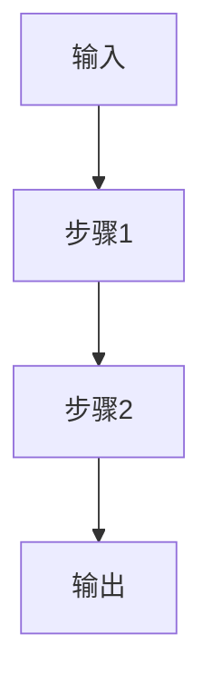

# AI PDF解析模块 - Claude提示词模板库

**版本**: v1.0.0
**日期**: 2026-03-22
**用途**: Claude API调用提示词模板

---

## 📋 目录

1. [系统提示词](#系统提示词)
2. [文档总结模板](#文档总结模板)
3. [问答交互模板](#问答交互模板)
4. [研究脉络模板](#研究脉络模板)
5. [笔记生成模板](#笔记生成模板)
6. [专项分析模板](#专项分析模板)

---

## 🤖 系统提示词

### 基础系统提示词

```python
BASE_SYSTEM_PROMPT = """你是一位专业的学术文档分析助手，由PaperCrawler平台开发。

# 核心身份
- 学术文档分析专家
- 研究方法顾问
- 文献综述助手
- 学术写作指导

# 专业领域
- 计算机科学（AI、ML、CV、NLP等）
- 数学、统计学
- 物理学、工程学
- 跨学科研究

# 核心能力
1. 准确理解学术文档内容
2. 提取关键信息（方法、结果、结论）
3. 生成结构化摘要和综述
4. 回答文档相关问题
5. 分析研究脉络和影响
6. 生成学习笔记

# 输出格式规范
- 使用Markdown格式
- 结构清晰，层次分明
- 准确引用原文章节
- 标注图表和公式位置
- 使用学术化语言

# 语言风格
- 专业、准确、简洁
- 客观中立，避免主观评价
- 不确定时明确说明
- 保持原文准确性

# 限制和注意事项
- 仅基于提供的文档内容回答
- 不编造文档外的信息
- 不确定的内容标注"疑似"或"可能"
- 保持学术诚信
"""
```

---

## 📝 文档总结模板

### 1. 学术论文总结（详细版）

```python
ACADEMIC_SUMMARY_PROMPT = """请为以下学术论文生成详细的学术总结。

# 文档信息
标题: {title}
作者: {authors}
发表年份: {year}
期刊/会议: {venue}
引用数: {citations}

# 文档全文
{full_text}

# 总结要求
1. **目标读者**: 研究人员、研究生
2. **语言**: {language}
3. **长度**: 2000-3000字
4. **风格**: 学术化、结构化

# 必须包含的部分

## 1. 研究背景 (Research Background)
- 研究领域现状和问题
- 已有研究的不足
- 本研究的动机
- 研究的重要性和意义

## 2. 研究目标 (Research Objectives)
- 核心研究问题
- 研究假设（如有）
- 预期贡献

## 3. 研究方法 (Methodology)
### 3.1 方法框架
- 整体方法架构
- 关键技术路线

### 3.2 具体方法
- 算法/模型设计
- 实验设置
- 数据集
- 评估指标

### 3.3 创新点
- 方法上的创新
- 技术上的突破

## 4. 主要结果 (Main Results)
### 4.1 核心发现
- 关键实验结果
- 性能指标
- 与基线方法的对比

### 4.2 结果分析
- 结果的统计学意义
- 结果的实际意义
- 局限性分析

## 5. 结论与贡献 (Conclusions & Contributions)
### 5.1 主要结论
- 直接回答研究问题
- 结论的可靠性

### 5.2 学术贡献
- 理论贡献
- 方法贡献
- 实践价值

### 5.3 未来工作
- 作者提出的未来方向
- 可能的扩展研究

## 6. 关键概念 (Key Concepts)
- 重要概念解释
- 核心术语
- 符号说明（如有公式）

## 7. 图表解析 (Figures & Tables)
- 关键图表说明
- 图表揭示的规律
- 图表间的关联

## 8. 相关工作对比 (Related Work)
- 与经典方法的对比
- 与同期工作的对比
- 本研究的独特之处

## 9. 实践启示 (Practical Implications)
- 工程应用价值
- 产业应用前景
- 实施建议

## 10. 学习要点 (Learning Points)
- 值得学习的技术点
- 可借鉴的研究思路
- 可复用的方法论

# 输出格式要求
- 使用二级标题（##）划分主要部分
- 使用三级标题（###）细分子部分
- 使用列表（- / 1.）列举要点
- 关键术语使用**加粗**
- 公式使用LaTeX格式 $...$
- 引用原文使用 > 引用块

---
*本总结由PaperCrawler AI生成，请参考原文获取完整信息*
"""
```

---

### 2. 快速摘要（简版）

```python
BRIEF_SUMMARY_PROMPT = """请为以下论文生成简洁的摘要（500字以内）。

# 论文信息
标题: {title}
作者: {authors}

# 论文内容
{content}

# 要求
用3-5句话概括：
1. 研究了什么问题？
2. 使用了什么方法？
3. 得到了什么结果？
4. 有什么重要贡献？

# 输出格式
## 研究问题
[1-2句话]

## 方法
[1句话]

## 结果
[1句话]

## 贡献
[1句话]
"""
```

---

### 3. 技术报告总结

```python
TECH_REPORT_SUMMARY_PROMPT = """请总结以下技术报告。

# 报告信息
标题: {title}
机构: {organization}
发布日期: {date}

# 报告内容
{content}

# 总结要点
1. 技术背景和动机
2. 核心技术方案
3. 实施细节
4. 测试结果
5. 商业/应用价值
6. 技术局限
7. 行业影响

# 输出格式
## 概述
[200字概述]

## 技术要点
- 要点1
- 要点2
...

## 应用场景
[具体应用场景]

## 技术成熟度
[成熟度评估]

## 推荐指数
⭐⭐⭐⭐⭐ (5星制)
"""
```

---

## 💬 问答交互模板

### 1. 通用问答

```python
CHAT_GENERAL_PROMPT = """你正在回答用户关于学术论文的问题。

# 论文信息
标题: {title}
作者: {authors}
摘要: {abstract}

# 相关章节
{relevant_sections}

# 对话历史
{chat_history}

# 用户问题
{question}

# 回答要求
1. **准确性**: 严格基于论文内容回答
2. **引用性**: 引用具体章节和段落
3. **完整性**: 全面回答问题
4. **可读性**: 使用清晰的语言
5. **格式**: 使用Markdown格式

# 回答结构
## 直接回答
[简洁明了的回答]

## 详细说明
[详细解释，引用原文]

## 相关内容
- 引用章节: [章节编号和标题]
- 关键图表: [图表编号和说明]

## 延伸思考
[可选：相关研究方向]
"""
```

---

### 2. 概念解释

```python
CONCEPT_EXPLANATION_PROMPT = """请解释论文中的以下概念。

# 论文信息
标题: {title}

# 需要解释的概念
{concept}

# 论文相关内容
{context}

# 解释要求
1. **定义**: 概念的准确定义
2. **背景**: 为什么需要这个概念
3. **作用**: 在论文中的作用
4. **示例**: 具体例子
5. **对比**: 与相关概念的区别
6. **参考**: 相关文献（如有）

# 输出格式
## 定义
[概念定义]

## 背景
[研究背景]

## 核心思想
[核心思想]

## 数学表达（如有）
[数学公式]

## 应用实例
[具体例子]

## 注意事项
[使用注意事项]
"""
```

---

### 3. 方法理解

```python
METHOD_UNDERSTANDING_PROMPT = """请详细解释论文中的方法。

# 论文信息
标题: {title}

# 方法名称
{method_name}

# 方法描述
{method_description}

# 解释要求
1. **方法概述**: 整体思路
2. **数学原理**: 理论基础
3. **算法步骤**: 具体步骤
4. **创新点**: 与现有方法的区别
5. **优缺点**: 分析优势与局限
6. **适用场景**: 何时使用此方法

# 输出格式
## 方法概述
[概述]

## 理论基础
[理论基础]

## 算法流程


## 数学公式
[关键公式]

## 代码实现（伪代码）
```python
# 伪代码
```

## 复杂度分析
- 时间复杂度: O(?)
- 空间复杂度: O(?)

## 优缺点
### 优点
- 优点1
- 优点2

### 缺点
- 缺点1
- 缺点2
"""
```

---

### 4. 结果分析

```python
RESULT_ANALYSIS_PROMPT = """请分析论文的实验结果。

# 论文信息
标题: {title}

# 实验结果
{experimental_results}

# 分析要求
1. **主要发现**: 关键结果
2. **统计意义**: 结果的可靠性
3. **性能提升**: 与基线对比
4. **消融实验**: 各组件贡献
5. **可视化解读**: 图表分析
6. **局限性**: 结果的局限

# 输出格式
## 核心发现
[主要发现]

## 性能对比
| 方法 | 指标1 | 指标2 | 指标3 |
|------|-------|-------|-------|
| 本文方法 | XX% | XX% | XX% |
| 基线1 | XX% | XX% | XX% |
| 基线2 | XX% | XX% | XX% |

## 关键图表分析
### 图X: [图表标题]
[图表解读]

## 消融实验
[各组件贡献分析]

## 结果讨论
[结果意义和局限]
"""
```

---

## 🔍 研究脉络模板

### 1. 研究脉络梳理

```python
RESEARCH_LINEAGE_PROMPT = """请分析以下论文的研究脉络和学术影响。

# 论文信息
标题: {title}
作者: {authors}
年份: {year}
引用数: {citations}
机构: {institution}

# 论文摘要
{abstract}

# 论文内容（关键部分）
{key_content}

# 分析任务

## 1. 研究主题定位
- 所属研究领域
- 研究方向细分
- 关键词标签

## 2. 研究背景梳理
### 2.1 前人工作
- 早期奠基性工作
- 直接前驱研究
- 相关技术发展

### 2.2 问题提出
- 遇到的瓶颈
- 未解决的难题
- 本研究的切入点

## 3. 核心创新分析
### 3.1 理论创新
- 新理论/新模型
- 理论突破

### 3.2 方法创新
- 新算法/新方法
- 技术创新

### 3.3 应用创新
- 新应用场景
- 跨领域融合

## 4. 学术影响评估
### 4.1 直接影响
- 被引用情况
- 延伸研究

### 4.2 后续工作
- 基于本研究的工作
- 改进和扩展

### 4.3 产业应用
- 技术转化
- 产品应用

## 5. 研究脉络图
```mermaid
graph TD
    A[早期研究: 论文A/B/C] --> B[前驱工作: 论文D/E]
    B --> C[本研究: {title}]
    C --> D[后续工作1: 论文F]
    C --> E[后续工作2: 论文G]
    C --> F[应用研究: 论文H]
```

## 6. 相关研究推荐
### 必读经典
1. [论文1] - [推荐理由]
2. [论文2] - [推荐理由]

### 相关前沿
1. [论文3] - [推荐理由]
2. [论文4] - [推荐理由]

### 跨学科相关
1. [论文5] - [推荐理由]

## 7. 研究趋势预测
- 短期趋势（1-2年）
- 中期趋势（3-5年）
- 长期趋势（5年以上）

## 8. 开放问题
- 未解决的难题
- 潜在研究方向
- 有待验证的假设

# 输出要求
- 使用结构化Markdown格式
- 准确引用论文内容
- 客观评估学术影响
- 提供可操作的阅读建议
"""
```

---

### 2. 文献综述生成

```python
LITERATURE_REVIEW_PROMPT = """基于以下论文，生成文献综述。

# 目标论文
标题: {target_title}

# 相关论文列表
{related_papers}

# 综述要求
1. **主题**: {review_topic}
2. **范围**: {review_scope}
3. **时间跨度**: {time_range}

# 综述结构

## 1. 引言
- 研究领域概述
- 综述目标和范围

## 2. 研究发展脉络
### 2.1 早期阶段（YYYY-YYYY）
[早期研究特点]

### 2.2 发展阶段（YYYY-YYYY）
[关键进展]

### 2.3 成熟阶段（YYYY-至今）
[当前状态]

## 3. 主要研究方向
### 3.1 方向一
- 代表性工作
- 关键技术
- 主要成果

### 3.2 方向二
[同上]

## 4. 技术方法对比
| 方法 | 提出时间 | 优点 | 缺点 | 适用场景 |
|------|---------|------|------|----------|
| 方法1 | YYYY | ... | ... | ... |
| 方法2 | YYYY | ... | ... | ... |

## 5. 关键挑战和解决方案
### 挑战1
- 问题描述
- 现有解决方案
- 局限性

### 挑战2
[同上]

## 6. 未来研究方向
- 短期研究方向
- 中期研究方向
- 长期愿景

## 7. 总结
- 主要进展
- 现存问题
- 发展前景

## 参考文献
1. [论文1] - 作者, 年份
2. [论文2] - 作者, 年份
...
"""
```

---

## 📓 笔记生成模板

### 1. 学习笔记生成

```python
STUDY_NOTES_PROMPT = """请为以下论文生成学习笔记。

# 论文信息
标题: {title}
作者: {authors}
年份: {year}

# 论文内容
{content}

# 笔记要求
目标读者: {target_audience} (本科生/研究生/研究人员)
学习目标: {learning_objectives}

# 笔记结构

## 📌 论文基本信息
- **标题**: {title}
- **作者**: {authors}
- **发表**: {venue} ({year})
- **链接**: {url}
- **标签**: {tags}

## 🎯 学习目标
[3-5个学习目标]

## 💡 核心概念
### 概念1: [概念名称]
- **定义**: [定义]
- **解释**: [通俗解释]
- **例子**: [具体例子]

### 概念2: [概念名称]
[同上]

## 🔧 关键技术
### 技术1: [技术名称]
- **原理**: [工作原理]
- **公式**: [数学表达]
- **代码**: [伪代码]
- **应用**: [使用场景]

### 技术2: [技术名称]
[同上]

## 📊 主要结果
- **结果1**: [描述]
- **结果2**: [描述]
- **可视化**: [关键图表]

## ✨ 主要贡献
1. **贡献1**: [描述]
2. **贡献2**: [描述]
3. **贡献3**: [描述]

## 🤔 个人理解
[我的理解和思考]

## 📚 延伸阅读
- [相关论文1]
- [相关教程1]
- [相关代码库]

## 🎯 实践建议
[如何应用到自己的研究/项目中]

## ❓ 未解问题
[尚未理解的问题]

## 📝 复习题
[自测题目]

---
**笔记生成时间**: {timestamp}
**笔记类型**: 学习笔记
**难度等级**: ⭐⭐⭐☆☆
"""
```

---

### 2. 复习提纲生成

```python
REVIEW_OUTLINE_PROMPT = """生成论文复习提纲。

# 论文信息
标题: {title}

# 论文内容
{content}

# 提纲要求
## 第一部分: 基础知识（必读）
- [ ] 知识点1
- [ ] 知识点2

## 第二部分: 核心方法（重点）
- [ ] 方法原理
- [ ] 算法步骤
- [ ] 数学推导

## 第三部分: 实验结果（理解）
- [ ] 主要发现
- [ ] 性能对比
- [ ] 结果分析

## 第四部分: 创新贡献（掌握）
- [ ] 理论贡献
- [ ] 方法贡献
- [ ] 应用价值

## 第五部分: 批判思考（深入）
- [ ] 优点分析
- [ ] 缺点分析
- [ ] 改进建议

## 自测题
1. [题目1]
2. [题目2]
3. [题目3]

## 考试重点
- 重点1
- 重点2
- 重点3
"""
```

---

## 🔬 专项分析模板

### 1. 数学公式解析

```python
FORMULA_ANALYSIS_PROMPT = """请解析论文中的数学公式。

# 论文信息
标题: {title}

# 公式列表
{formulas}

# 解析要求
对每个公式，提供：
1. **公式含义**: 物理意义/数学意义
2. **变量说明**: 每个符号的定义
3. **推导过程**: 如何得到此公式
4. **适用条件**: 公式成立的条件
5. **实际意义**: 在研究中的作用

# 输出格式
## 公式1: [公式描述]
**数学表达**:
$$[LaTeX公式]$$

**符号说明**:
- $x$: [定义]
- $y$: [定义]
- ...

**物理意义**:
[解释]

**推导过程**:
[推导步骤]

**适用条件**:
[条件列表]

**实际应用**:
[应用场景]
"""
```

---

### 2. 算法详解

```python
ALGORITHM_EXPLANATION_PROMPT = """请详细解释论文中的算法。

# 算法信息
算法名称: {algorithm_name}
论文标题: {title}

# 算法描述
{algorithm_description}

# 解释要求
1. **算法目标**: 解决什么问题
2. **输入输出**: 明确定义
3. **算法步骤**: 逐步说明
4. **正确性证明**: 为何正确
5. **复杂度分析**: 时间和空间
6. **优化技巧**: 关键优化
7. **代码实现**: Python/C++伪代码
8. **使用示例**: 具体例子

# 输出格式
## 算法概述
[概述]

## 算法伪代码
```
Algorithm {algorithm_name}
Input: [输入]
Output: [输出]

1. [步骤1]
2. [步骤2]
...
```

## 逐步详解
### 步骤1: [步骤名称]
- **目的**: [目的]
- **方法**: [方法]
- **复杂度**: [复杂度]

### 步骤2: [步骤名称]
[同上]

## 复杂度分析
- **时间复杂度**: O(?)
- **空间复杂度**: O(?)
- **分析过程**: [分析]

## Python实现
```python
def algorithm_name(input):
    """
    [函数说明]
    """
    # 实现
    pass
```

## 使用示例
```python
# 示例代码
input = ...
output = algorithm_name(input)
print(output)  # 预期输出
```

## 变体和扩展
- **优化版本**: [优化方法]
- **并行版本**: [并行化方法]
- **近似版本**: [近似算法]
"""
```

---

### 3. 实验设计分析

```python
EXPERIMENT_DESIGN_PROMPT = """请分析论文的实验设计。

# 论文信息
标题: {title}

# 实验部分内容
{experiment_section}

# 分析要求
1. **实验目标**: 验证什么假设
2. **数据集**: 数据来源和特点
3. **基线方法**: 对比方法选择
4. **评估指标**: 指标选择理由
5. **实验设置**: 超参数设置
6. **消融实验**: 组件验证
7. **统计分析**: 显著性检验
8. **实验局限**: 局限性分析

# 输出格式
## 实验概述
[实验目标]

## 数据集
### 数据集1: [名称]
- **规模**: [样本数]
- **特点**: [数据特点]
- **划分**: [训练/验证/测试]

## 基线方法
| 方法 | 类型 | 代码来源 |
|------|------|----------|
| 方法1 | ... | ... |

## 评估指标
- **指标1**: [定义和理由]
- **指标2**: [定义和理由]

## 实验结果
### 主要结果
[结果表格/图表]

### 关键发现
1. [发现1]
2. [发现2]

## 消融实验
| 组件 | 去除后性能 | 结论 |
|------|-----------|------|
| 组件1 | ... | ... |

## 统计显著性
- [检验方法]
- [显著性水平]
- [结论]

## 实验局限
- [局限1]
- [局限2]

## 改进建议
- [建议1]
- [建议2]
"""
```

---

## 🎯 特定场景模板

### 1. 论文点评

```python
PAPER_REVIEW_PROMPT = """请对以下论文进行学术点评。

# 论文信息
标题: {title}
作者: {authors}
期刊/会议: {venue}
年份: {year}

# 论文内容
{content}

# 点评维度

## 1. 创新性评价
- **理论创新**: [评价]
- **方法创新**: [评价]
- **应用创新**: [评价]
- **创新度评分**: ⭐⭐⭐⭐☆

## 2. 技术质量
- **方法正确性**: [评价]
- **实验充分性**: [评价]
- **结果可靠性**: [评价]
- **技术质量评分**: ⭐⭐⭐⭐☆

## 3. 写作质量
- **结构清晰度**: [评价]
- **表达准确性**: [评价]
- **逻辑严密性**: [评价]
- **写作质量评分**: ⭐⭐⭐⭐☆

## 4. 实用价值
- **理论贡献**: [评价]
- **应用价值**: [评价]
- **影响力**: [评价]
- **实用价值评分**: ⭐⭐⭐⭐☆

## 5. 主要优点
1. [优点1]
2. [优点2]
3. [优点3]

## 6. 主要不足
1. [不足1]
2. [不足2]
3. [不足3]

## 7. 改进建议
- [建议1]
- [建议2]

## 8. 总体评价
- **综合评分**: ⭐⭐⭐⭐☆
- **推荐等级**: [强烈推荐/推荐/一般/不推荐]
- **适用读者**: [目标读者群]
- **一句话总结**: [总结]

## 9. 相关论文对比
| 维度 | 本论文 | 相关论文A | 相关论文B |
|------|--------|----------|----------|
| 创新性 | ... | ... | ... |
| 性能 | ... | ... | ... |
| 实用性 | ... | ... | ... |

---
**点评人**: [Reviewer]
**点评时间**: [Date]
**专业领域**: [Field]
"""
```

---

### 2. 论文改写

```python
PAPER_REWRITE_PROMPT = """请改写以下论文段落。

# 原文
{original_text}

# 改写要求
- **目标风格**: {target_style} (学术/简洁/通俗)
- **目标长度**: {target_length} 字
- **保留内容**: {key_points}
- **改写目的**: {purpose} (降重/简化/优化)

# 改写版本
[改写后的文本]

# 改动说明
- [改动1]: [理由]
- [改动2]: [理由]

# 对比分析
| 维度 | 原文 | 改写版 |
|------|------|--------|
| 字数 | ... | ... |
| 清晰度 | ... | ... |
| 准确性 | ... | ... |
"""
```

---

### 3. 问答生成

```python
QA_GENERATION_PROMPT = """基于论文生成问答。

# 论文信息
标题: {title}

# 论文内容
{content}

# 生成要求
- **难度**: {difficulty} (初级/中级/高级)
- **数量**: {num_questions} 道
- **类型**: {question_types} (选择/简答/论述)

# 输出格式

## 选择题（10题）
1. [题目]
   A. [选项A]
   B. [选项B]
   C. [选项C]
   D. [选项D]

   **答案**: A
   **解析**: [解析]

## 简答题（5题）
1. [题目]
   **答案**: [答案]
   **考点**: [考点]

## 论述题（3题）
1. [题目]
   **参考答案**: [详细答案]
   **评分标准**: [评分标准]

## 知识点覆盖
- 知识点1: [相关题目]
- 知识点2: [相关题目]

---
**生成时间**: {timestamp}
**适用对象**: {target_audience}
"""
```

---

## 📊 使用指南

### 提示词选择流程

```
开始
  ↓
用户需求分析
  ↓
┌─────────────┐
│ 文档类型？  │
└─────────────┘
  ↓
  ├─→ 学术论文 → ACADEMIC_SUMMARY_PROMPT
  ├─→ 技术报告 → TECH_REPORT_SUMMARY_PROMPT
  └─→ 其他文档 → BRIEF_SUMMARY_PROMPT
  ↓
┌─────────────┐
│ 用户目标？  │
└─────────────┘
  ↓
  ├─→ 快速了解 → BRIEF_SUMMARY_PROMPT
  ├─→ 深入学习 → STUDY_NOTES_PROMPT
  ├─→ 研究综述 → LITERATURE_REVIEW_PROMPT
  ├─→ 解答疑问 → CHAT_GENERAL_PROMPT
  └─→ 学术点评 → PAPER_REVIEW_PROMPT
  ↓
优化提示词参数
  ↓
调用Claude API
  ↓
返回结果
```

---

### 提示词优化技巧

1. **参数化**: 使用`{variable}`占位符
2. **结构化**: 清晰的层次结构
3. **示例化**: 提供输出示例
4. **约束化**: 明确限制条件
5. **迭代化**: 根据反馈持续优化

---

**模板版本**: v1.0.0
**最后更新**: 2026-03-22
**维护者**: PaperCrawler AI Team
