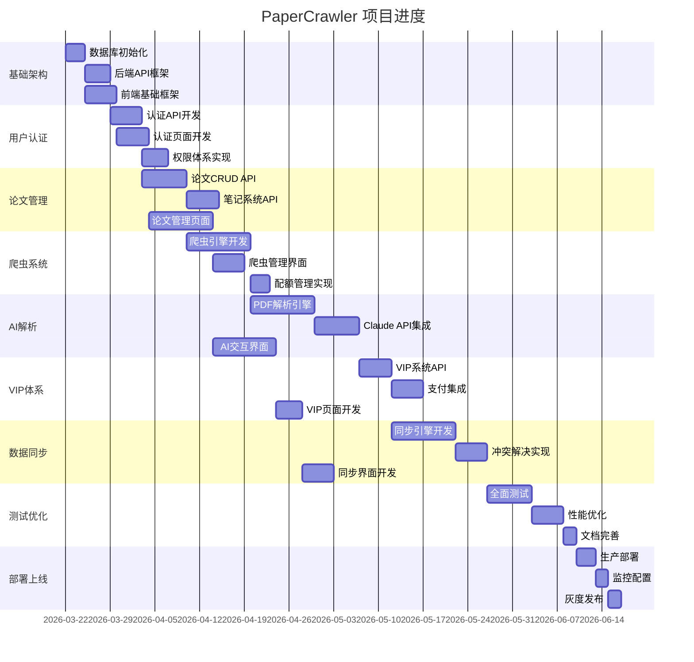

# PaperCrawler 项目实施路线图

> 基于多专家分析的完整项目实施计划
>
> 创建日期：2026-03-22
>
> 项目版本：v2.0.0 - 智研论文：AI驱动的多用户论文管理协作平台

---

## 📋 目录

- [项目概述](#项目概述)
- [技术栈总览](#技术栈总览)
- [实施阶段](#实施阶段)
- [资源需求](#资源需求)
- [风险与应对](#风险与应对)
- [成功指标](#成功指标)

---

## 项目概述

### 核心目标

构建一个**一站式论文管理工具**，实现：

```
自动爬取论文 → 本地AI智能解析PDF → 多端同步存储 → 分级权限管理 → VIP增值功能
```

### 4大核心模块

1. **用户权限体系** - 多用户 + VIP + 超管
2. **论文信息管理** - 爬虫同步 + 手动管理 + 笔记系统
3. **AI智能解析** - 本地Claude Code PDF梳理
4. **数据同步** - 本地缓存 + 远端数据库

---

## 技术栈总览

| 层级 | 技术方案 | 说明 |
|------|---------|------|
| **前端** | Vue3 + Element Plus + TypeScript | 组合式API，类型安全 |
| **状态管理** | Pinia | 6个核心Store |
| **路由** | Vue Router | 40+ 路由，权限守卫 |
| **后端** | C++ (cpp-httplib) + Node.js (Mock) | 高性能爬虫 + 快速原型 |
| **数据库** | MySQL (云端) + SQLite (本地) | 双存储架构 |
| **AI引擎** | Claude API + PyMuPDF | 本地PDF解析 |
| **认证** | JWT + Refresh Token | 15分钟访问令牌 + 30天刷新令牌 |
| **缓存** | Redis | 任务队列 + 会话存储 |
| **文件存储** | 本地磁盘 + OSS | PDF文件 + 附件 |

---

## 实施阶段

## 🎯 阶段1：基础架构搭建（2周）

### 目标
建立项目基础设施，完成数据库和核心API框架

### 任务清单

#### 1.1 数据库初始化
- [ ] 创建MySQL数据库 `papercrawler`
- [ ] 执行完整架构迁移脚本
  ```bash
  mysql -u root -p papercrawler < database/complete-schema-mysql.sql
  mysql -u root -p papercrawler < database/indexes-optimization-guide.sql
  ```
- [ ] 创建SQLite本地缓存数据库
  ```bash
  sqlite3 papercrawler.db < database/complete-schema-sqlite.sql
  ```
- [ ] 验证表结构和索引

#### 1.2 后端API框架
- [ ] 搭建C++ REST API服务器（基于现有api_server.cpp）
- [ ] 实现JWT认证中间件
- [ ] 实现权限控制中间件（RBAC）
- [ ] 添加CORS支持
- [ ] 配置请求日志和错误处理

#### 1.3 前端基础框架
- [ ] 配置Vue Router（40+ 路由）
- [ ] 配置Pinia Stores（auth, papers, ai, crawler, admin, ui）
- [ ] 实现权限控制指令（v-permission）
- [ ] 实现路由守卫（权限验证）
- [ ] 配置Element Plus主题

**预计产出：**
- ✅ 可运行的数据库
- ✅ 基础API服务器
- ✅ 前端框架结构

---

## 🎯 阶段2：用户认证与权限（2周）

### 目标
实现完整的用户认证、注册、权限管理

### 任务清单

#### 2.1 用户认证API
- [ ] POST /api/auth/register - 用户注册
- [ ] POST /api/auth/login - 用户登录
- [ ] POST /api/auth/logout - 用户登出
- [ ] POST /api/auth/refresh - 刷新令牌
- [ ] GET /api/auth/me - 获取当前用户
- [ ] POST /api/auth/forgot-password - 找回密码
- [ ] POST /api/auth/reset-password - 重置密码

#### 2.2 前端认证页面
- [ ] 登录页（已有，需优化）
- [ ] 注册页
- [ ] 找回密码页
- [ ] 个人中心页
- [ ] 密码修改页

#### 2.3 权限体系
- [ ] 实现4级角色：user → premium → admin → superadmin
- [ ] 实现RBAC权限检查
- [ ] 添加权限管理界面（管理员）
- [ ] 实现用户管理CRUD

**预计产出：**
- ✅ 完整的认证系统
- ✅ 用户管理后台
- ✅ 权限控制机制

---

## 🎯 阶段3：论文管理核心功能（3周）

### 目标
实现论文的增删改查、搜索、筛选、笔记功能

### 任务清单

#### 3.1 论文管理API
- [ ] GET /api/papers - 论文列表（分页、筛选、排序）
- [ ] POST /api/papers - 添加论文
- [ ] GET /api/papers/:id - 论文详情
- [ ] PUT /api/papers/:id - 更新论文
- [ ] DELETE /api/papers/:id - 删除论文
- [ ] POST /api/papers/:id/bookmark - 收藏/取消收藏
- [ ] GET /api/papers/search - 论文搜索

#### 3.2 笔记系统API
- [ ] GET /api/papers/:id/notes - 获取笔记列表
- [ ] POST /api/papers/:id/notes - 添加笔记
- [ ] PUT /api/notes/:id - 更新笔记
- [ ] DELETE /api/notes/:id - 删除笔记
- [ ] POST /api/notes/:id/export - 导出笔记（Word/TXT/MD）

#### 3.3 前端论文管理页面
- [ ] 论文列表页（搜索、筛选、分页）
- [ ] 论文详情页（PDF预览、笔记）
- [ ] 手动添加论文表单
- [ ] 批量导入功能
- [ ] 分类/标签管理
- [ ] 笔记编辑器（Markdown支持）

**预计产出：**
- ✅ 完整的论文CRUD功能
- ✅ 笔记系统
- ✅ 搜索和筛选

---

## 🎯 阶段4：爬虫系统集成（3周）

### 目标
实现多源论文爬虫，自动同步论文信息

### 任务清单

#### 4.1 爬虫引擎
- [ ] 实现Scrapy爬虫框架
- [ ] 知网爬虫（CNKI）
- [ ] IEEE爬虫
- [ ] ArXiv爬虫
- [ ] PubMed爬虫
- [ ] 爬虫任务队列（Redis Streams）

#### 4.2 爬虫管理API
- [ ] POST /api/crawler/start - 启动爬虫任务
- [ ] GET /api/crawler/tasks - 获取任务列表
- [ ] GET /api/crawler/tasks/:id - 任务详情
- [ ] POST /api/crawler/tasks/:id/stop - 停止任务
- [ ] GET /api/crawler/sources - 获取爬虫源配置
- [ ] PUT /api/crawler/sources/:id - 更新爬虫源

#### 4.3 前端爬虫管理
- [ ] 爬虫配置页（添加/编辑爬虫源）
- [ ] 爬虫任务列表（监控进度）
- [ ] 批量导入页（DOI批量导入）

#### 4.4 配额管理
- [ ] 免费用户：5次/天
- [ ] VIP用户：无限制
- [ ] 超级管理员：无限制

**预计产出：**
- ✅ 多源爬虫系统
- ✅ 爬虫管理界面
- ✅ 配额控制

---

## 🎯 阶段5：AI PDF解析（4周）

### 目标
实现本地AI PDF解析，智能总结和问答

### 任务清单

#### 5.1 PDF解析引擎
- [ ] 集成PyMuPDF（文本提取）
- [ ] 集成pdfplumber（表格提取）
- [ ] 集成pix2tex（公式提取）
- [ ] 实现PDF文件上传接口
- [ ] 实现解析结果缓存

#### 5.2 Claude API集成
- [ ] POST /api/ai/parse-pdf - 上传并解析PDF
- [ ] POST /api/ai/generate-summary - 生成摘要
- [ ] POST /api/ai/chat - AI对话
- [ ] GET /api/ai/history - 解析历史
- [ ] 实现流式输出（SSE）

#### 5.3 前端AI交互界面
- [ ] PDF上传页（拖拽上传）
- [ ] AI对话界面（ChatGPT风格）
- [ ] 解析结果展示页
- [ ] 笔记自动生成
- [ ] 一键保存到笔记

#### 5.4 成本优化
- [ ] 智能缓存（命中率>40%）
- [ ] 提示词优化
- [ ] 模型自动选择（Haiku/Sonnet/Opus）
- [ ] 使用量统计和监控

**预计产出：**
- ✅ AI PDF解析系统
- ✅ Claude API集成
- ✅ 智能对话界面

---

## 🎯 阶段6：VIP付费体系（2周）

### 目标
实现VIP订阅、充值、权益管理

### 任务清单

#### 6.1 VIP系统API
- [ ] GET /api/vip/plans - 获取套餐列表
- [ ] POST /api/vip/subscribe - 订阅VIP
- [ ] POST /api/vip/renew - 续费
- [ ] GET /api/vip/status - VIP状态
- [ ] GET /api/vip/quota - 配额使用情况
- [ ] POST /api/vip/webhook - 支付回调

#### 6.2 支付集成
- [ ] 微信支付
- [ ] 支付宝
- [ ] PayPal（可选）

#### 6.3 前端VIP页面
- [ ] VIP套餐展示页
- [ ] 支付页面
- [ ] 我的订单页
- [ ] 权益对比表
- [ ] 配额使用统计

#### 6.4 VIP权益
- [ ] 无限爬虫次数
- [ ] AI PDF解析（100万tokens/月）
- [ ] 云端存储10GB+
- [ ] 批量导出
- [ ] 优先客服

**预计产出：**
- ✅ VIP订阅系统
- ✅ 支付集成
- ✅ 权益管理

---

## 🎯 阶段7：数据同步系统（3周）

### 目标
实现本地-云端双向同步，离线可用

### 任务清单

#### 7.1 同步引擎
- [ ] POST /api/sync/start - 启动同步
- [ ] GET /api/sync/status - 同步状态
- [ ] POST /api/sync/conflicts/:id/resolve - 冲突解决
- [ ] 实现增量同步（向量时钟）
- [ ] 实现离线队列

#### 7.2 冲突解决策略
- [ ] Last-Write-Wins（时间戳）
- [ ] 客户端优先
- [ ] 服务端优先
- [ ] 字段级合并
- [ ] 手动解决UI

#### 7.3 数据库迁移
- [ ] 执行同步架构迁移
  ```bash
  mysql -u root -p papercrawler < backend/migrations/004_add_sync_support_mysql.sql
  sqlite3 papercrawler.db < backend/migrations/004_add_sync_support_sqlite.sql
  ```
- [ ] 数据同步验证

#### 7.4 前端同步界面
- [ ] 同步状态指示器
- [ ] 冲突解决对话框
- [ ] 同步历史记录
- [ ] 设备管理页

**预计产出：**
- ✅ 双向同步系统
- ✅ 冲突解决机制
- ✅ 离线可用

---

## 🎯 阶段8：测试与优化（2周）

### 目标
全面测试、性能优化、bug修复

### 任务清单

#### 8.1 测试
- [ ] 单元测试（后端）
- [ ] 单元测试（前端）
- [ ] 集成测试
- [ ] 性能测试（压力测试）
- [ ] 安全测试
- [ ] 用户验收测试

#### 8.2 性能优化
- [ ] 数据库查询优化
- [ ] API响应时间优化（目标<200ms P95）
- [ ] 前端加载优化（代码分割、懒加载）
- [ ] 图片压缩和CDN
- [ ] 缓存策略优化

#### 8.3 安全加固
- [ ] SQL注入防护
- [ ] XSS防护
- [ ] CSRF防护
- [ ] 速率限制
- [ ] 敏感数据加密

#### 8.4 文档完善
- [ ] API文档
- [ ] 部署文档
- [ ] 用户手册
- [ ] 运维手册

**预计产出：**
- ✅ 测试覆盖率>80%
- ✅ 性能达标
- ✅ 安全漏洞修复
- ✅ 完整文档

---

## 🎯 阶段9：部署与上线（1周）

### 目标
生产环境部署、监控告警、灰度发布

### 任务清单

#### 9.1 部署准备
- [ ] 生产环境配置
- [ ] 数据库备份策略
- [ ] SSL证书配置
- [ ] 域名配置

#### 9.2 监控告警
- [ ] Prometheus + Grafana
- [ ] 日志聚合（ELK）
- [ ] 错误追踪（Sentry）
- [ ] 性能监控
- [ ] 告警规则配置

#### 9.3 灰度发布
- [ ] 小范围测试（5%用户）
- [ ] 逐步扩大（20% → 50% → 100%）
- [ ] 监控指标
- [ ] 回滚预案

**预计产出：**
- ✅ 生产环境运行
- ✅ 监控系统
- ✅ 正式上线

---

## 资源需求

### 人力资源

| 角色 | 人数 | 职责 |
|------|------|------|
| **后端工程师** | 2 | C++ API开发、爬虫开发 |
| **前端工程师** | 2 | Vue3页面开发、组件开发 |
| **AI工程师** | 1 | Claude API集成、PDF解析 |
| **数据库工程师** | 1 | 数据库设计、优化 |
| **测试工程师** | 1 | 测试用例、自动化测试 |
| **产品经理** | 1 | 需求管理、进度协调 |
| **UI设计师** | 1 | 界面设计、交互设计 |

### 技术资源

#### 服务器
- **应用服务器**：4核8G × 2台（负载均衡）
- **数据库服务器**：8核16G × 1台（主库）+ 4核8G × 1台（从库）
- **Redis服务器**：2核4G × 1台
- **文件存储**：OSS或NAS（1TB起）

#### 第三方服务
- **Claude API**：按需付费（预计$100-500/月）
- **支付接口**：微信/支付宝（按交易额收费）
- **CDN**：按流量计费
- **监控服务**：自建Prometheus或使用云服务

---

## 风险与应对

| 风险 | 影响 | 概率 | 应对措施 |
|------|------|------|---------|
| **Claude API限流** | 高 | 中 | 智能缓存、请求队列、备用方案 |
| **爬虫反爬** | 中 | 高 | 代理IP池、请求频率控制、User-Agent轮换 |
| **数据库性能** | 高 | 中 | 索引优化、读写分离、缓存层 |
| **数据同步冲突** | 中 | 中 | 多种冲突策略、手动解决UI |
| **支付安全** | 高 | 低 | 使用官方SDK、签名验证、回调加密 |
| **用户流失** | 高 | 中 | 优化体验、增加粘性功能、激励体系 |

---

## 成功指标

### 技术指标

| 指标 | 目标值 | 当前值 |
|------|--------|--------|
| API响应时间（P95） | <200ms | - |
| 系统可用性 | >99.9% | - |
| 同步成功率 | >99% | - |
| 缓存命中率 | >80% | - |
| 测试覆盖率 | >80% | - |

### 业务指标

| 指标 | 目标值（3个月） | 目标值（6个月） |
|------|---------------|---------------|
| 注册用户数 | 1,000+ | 5,000+ |
| 日活用户（DAU） | 100+ | 500+ |
| VIP转化率 | 5%+ | 8%+ |
| 用户留存率 | 60%+ | 70%+ |
| AI分析使用率 | 30%+ | 40%+ |

---

## 项目里程碑



**预计总工期：21周（约5个月）**

---

## 附录

### 相关文档

#### 架构设计
- `ARCHITECTURE-ANALYSIS-REPORT.md` - 系统架构分析
- `BACKEND_API_DESIGN.md` - 后端API设计
- `FRONTEND_IMPLEMENTATION_PLAN.md` - 前端实现计划
- `DATABASE_DOCUMENTATION.md` - 数据库文档

#### 功能模块
- `AI_PDF_PARSING_MODULE_DESIGN.md` - AI PDF解析设计
- `SYNC_ARCHITECTURE.md` - 数据同步架构
- `AI_PDF_IMPLEMENTATION_GUIDE.md` - AI实现指南

#### 快速参考
- `FRONTEND_QUICK_REFERENCE.md` - 前端快速参考
- `SYNC_QUICK_REFERENCE.md` - 同步快速参考
- `AI_PDF_QUICK_START.md` - AI快速开始

#### 数据库
- `database/complete-schema-mysql.sql` - MySQL完整架构
- `database/complete-schema-sqlite.sql` - SQLite完整架构
- `database/README.md` - 数据库快速开始

### 快速命令

```bash
# 初始化数据库
mysql -u root -p papercrawler < database/complete-schema-mysql.sql

# 启动后端服务器
cd backend && ./build/api_server

# 启动前端开发服务器
cd frontend && npm run dev

# 运行测试
npm run test

# 构建生产版本
npm run build
```

---

## 联系与支持

如有问题或需要协助，请参考：
- 项目文档：`E:\PaperCrawler\`
- 数据库文档：`E:\PaperCrawler\database\`
- 设计文档：查看各模块的.md文件

---

**文档版本**: v1.0.0
**最后更新**: 2026-03-22
**维护者**: PaperCrawler Development Team
