# PaperCrawler 数据库实体关系图 (ER Diagram)

本文档使用 Mermaid 图表展示 PaperCrawler 数据库的实体关系。

---

## 核心实体关系总览

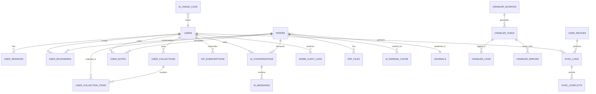

---

## 1. 用户权限模块

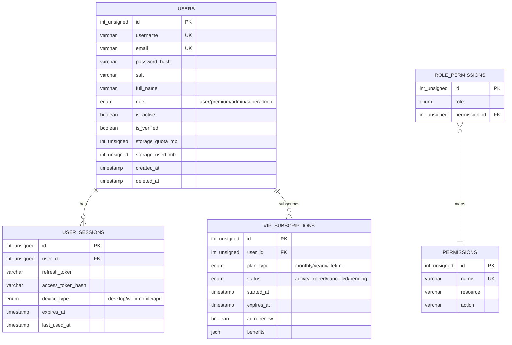

---

## 2. 论文管理模块

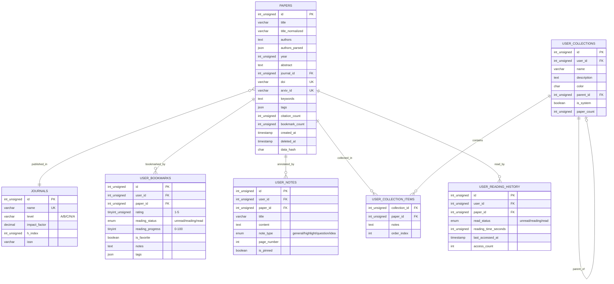

---

## 3. 爬虫管理模块

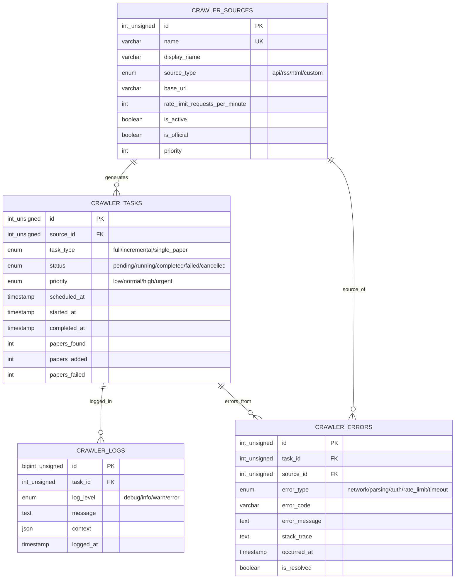

---

## 4. AI 分析模块

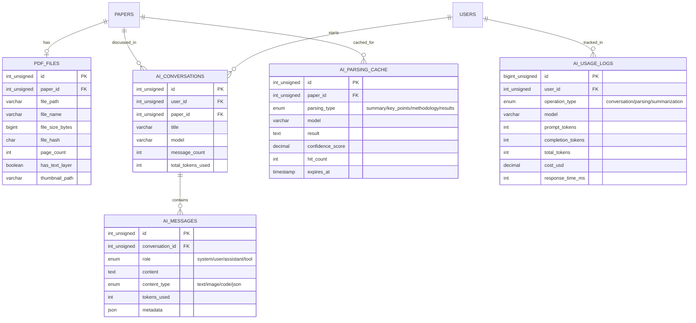

---

## 5. 数据同步模块

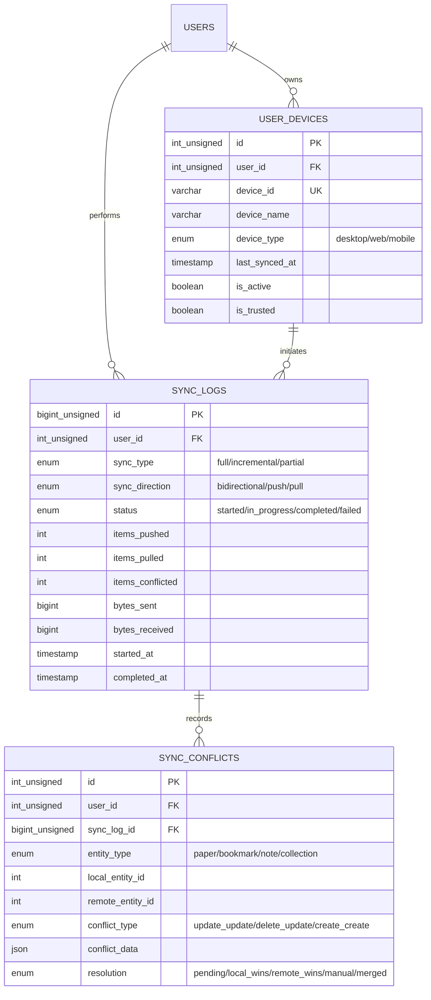

---

## 6. 审计和统计模块

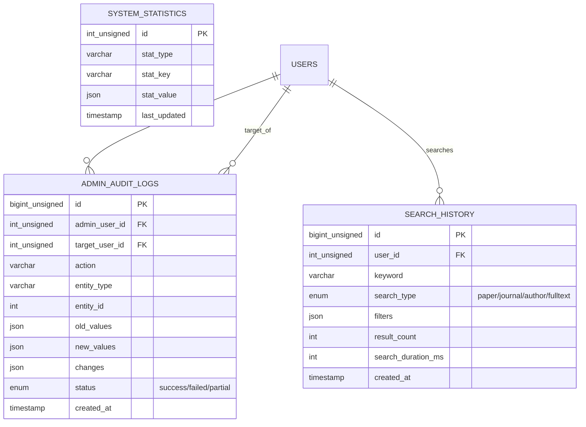

---

## 数据流向图

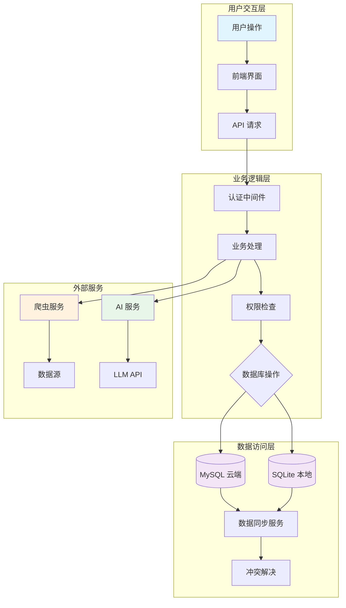

---

## 表关系详细说明

### 一对多关系 (1:N)

| 主表 | 从表 | 关系说明 |
|------|------|----------|
| users | user_sessions | 一个用户有多个会话 |
| users | user_bookmarks | 一个用户有多个书签 |
| users | user_collections | 一个用户有多个收藏夹 |
| users | ai_conversations | 一个用户有多个对话 |
| papers | user_bookmarks | 一篇论文可被多个用户收藏 |
| papers | user_notes | 一篇论文有多个用户笔记 |
| journals | papers | 一个期刊有多篇论文 |
| crawler_sources | crawler_tasks | 一个源有多个任务 |

### 多对多关系 (M:N)

| 表A | 表B | 中间表 | 关系说明 |
|-----|-----|--------|----------|
| users | papers | user_bookmarks | 用户收藏论文 |
| users | papers | user_notes | 用户标注论文 |
| collections | papers | user_collection_items | 收藏夹包含论文 |

### 自引用关系

| 表 | 字段 | 关系说明 |
|-----|------|----------|
| user_collections | parent_id | 收藏夹的父子关系 |
| papers | - | 引用关系（通过 citations） |

---

## 索引策略可视化

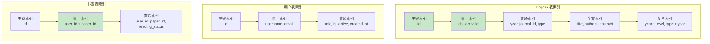

---

## 数据分区建议（大数据量场景）

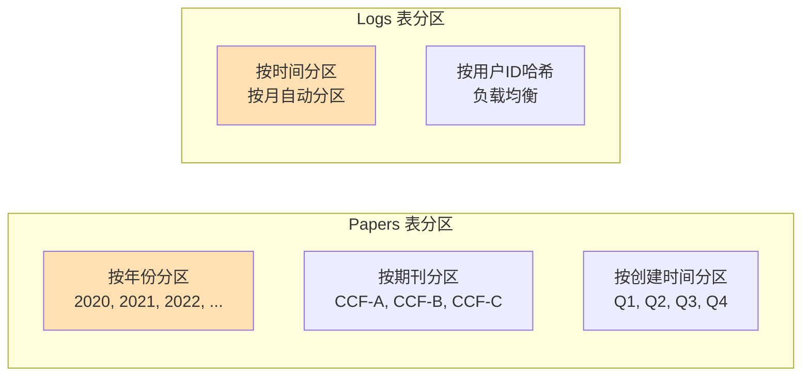

---

## 完整数据库架构图

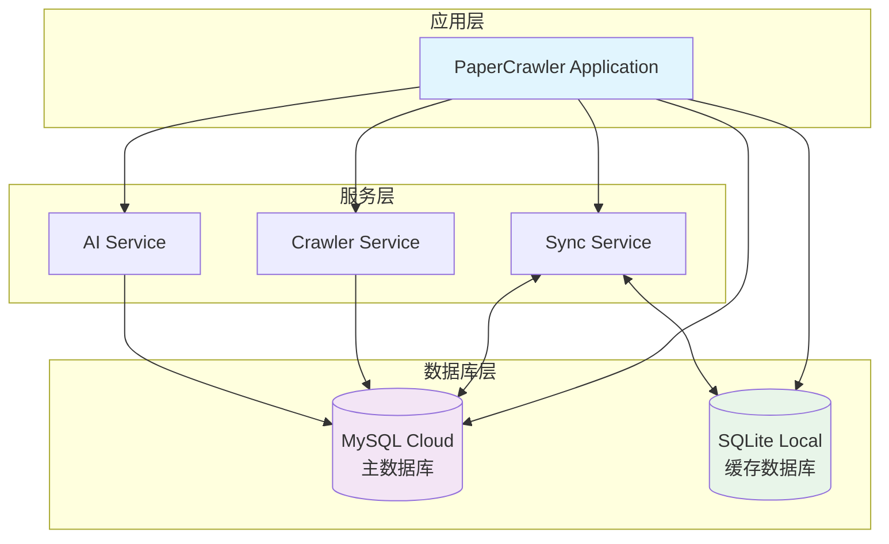

---

## 使用说明

### 在支持 Mermaid 的 Markdown 查看器中查看

1. **GitHub**: 直接在 GitHub 上查看此文件
2. **VS Code**: 安装 Mermaid Preview 插件
3. **在线工具**: https://mermaid.live

### 导出为图片

```bash
# 使用 Mermaid CLI
npm install -g @mermaid-js/mermaid-cli
mmdc -i ER-DIAGRAM.md -o er-diagram.png

# 或使用在线工具
# 访问 https://mermaid.live
# 粘贴 Mermaid 代码并导出
```

---

**版本**: 2.0.0
**最后更新**: 2026-03-22
**维护者**: PaperCrawler 开发团队
